[**Figure (X).**](https://htmlpreview.github.io/?https://github.com/aryastark5/web_bench/blob/gh-pages/display_files/output_numerical_attributes_assessment/two_versions_numerical_attributes_vs_neg_logBH_/Set_Symmetric_Difference_in_Neighborhood_Gene_List_Size_vs._Difference_in_-Log_Benjamini-Hochberg_between_PathFX_Versions.html)
   
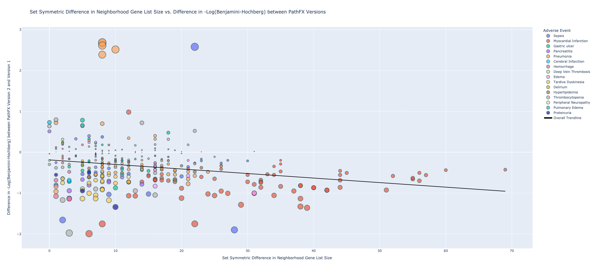
   
   

[**Figure (X).**](https://htmlpreview.github.io/?https://github.com/aryastark5/web_bench/blob/gh-pages/display_files/output_numerical_attributes_assessment/two_versions_numerical_attributes_vs_neg_logBH_/Difference_in_Neighborhood_Gene_List_Percentage_with_Intersecting_Interactome_Gene_List_Size_vs._Difference_in_-Log_Benjamini-Hochberg_between_PathFX_Versions.html)
   
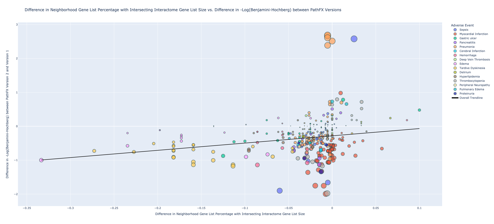
   
   

[**Figure (X).**](https://htmlpreview.github.io/?https://github.com/aryastark5/web_bench/blob/gh-pages/display_files/output_numerical_attributes_assessment/two_versions_numerical_attributes_vs_neg_logBH_/Difference_in_Unique_Neighborhood_Gene_List_Percentage_with_Intersecting_Interactome_Gene_List_Size_vs._Difference_in_-Log_Benjamini-Hochberg_between_PathFX_Versions.html)
   

   
   

[**Figure (X).**](https://htmlpreview.github.io/?https://github.com/aryastark5/web_bench/blob/gh-pages/display_files/output_numerical_attributes_assessment/two_versions_numerical_attributes_vs_neg_logBH_/Difference_in_Ratio_of_Drug_Targets_to_Neighborhood_Genes_vs._Difference_in_-Log_Benjamini-Hochberg_between_PathFX_Versions.html)
   
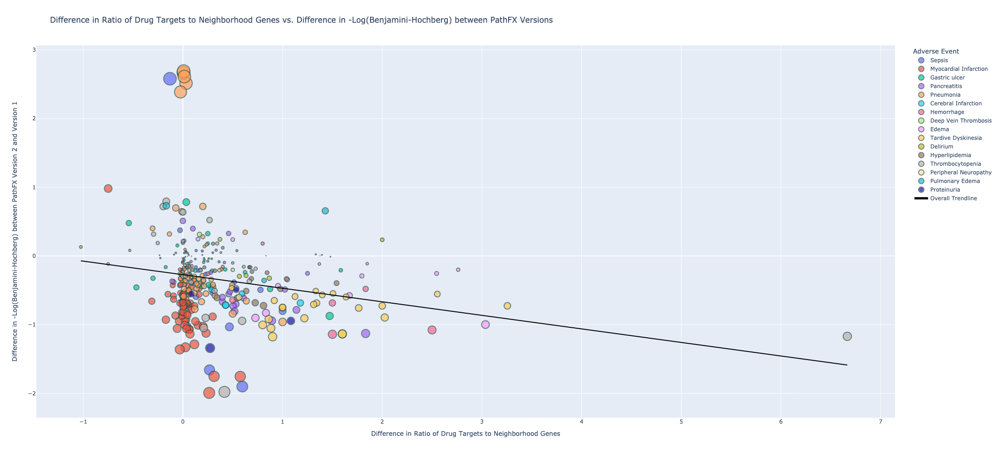
   
   

[**Figure (X).**](https://htmlpreview.github.io/?https://github.com/aryastark5/web_bench/blob/gh-pages/display_files/output_numerical_attributes_assessment/two_versions_numerical_attributes_vs_neg_logBH_/Difference_in_Neighbrohood_Gene_List_Percentage_vs._Difference_in_-Log_Benjamini-Hochberg_between_PathFX_Versions.html)
   
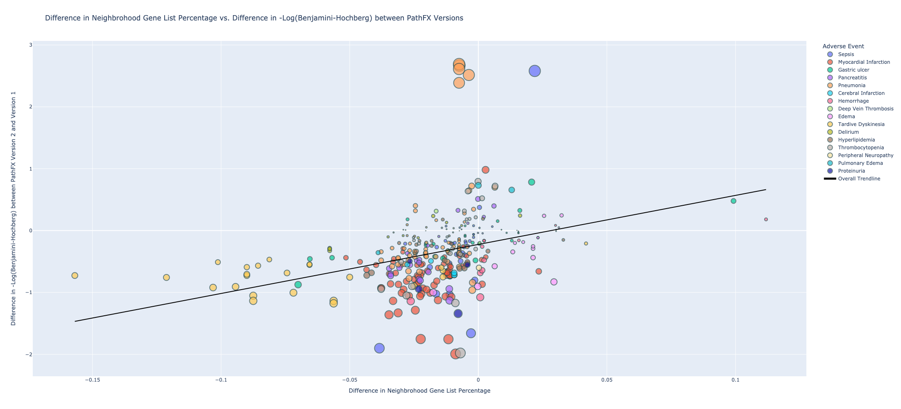
   
   

[**Figure (X).**](https://htmlpreview.github.io/?https://github.com/aryastark5/web_bench/blob/gh-pages/display_files/output_numerical_attributes_assessment/two_versions_numerical_attributes_vs_neg_logBH_/Difference_in_Unique_Neighborhood_Gene_List_Percentage_vs._Difference_in_-Log_Benjamini-Hochberg_between_PathFX_Versions.html)
   
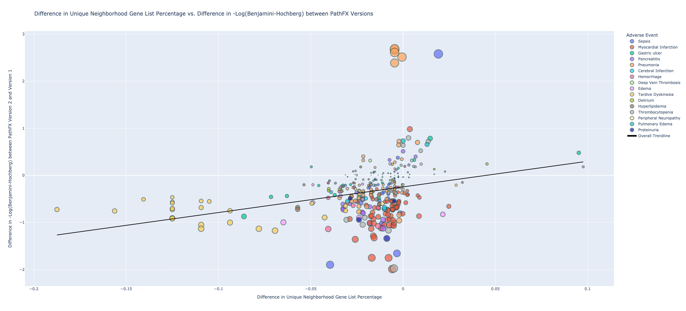
   
   

[**Figure (X).**](https://htmlpreview.github.io/?https://github.com/aryastark5/web_bench/blob/gh-pages/display_files/output_numerical_attributes_assessment/two_versions_numerical_attributes_vs_neg_logBH_/Difference_in_Unique_Neighborhood_Gene_List_Size_vs._Difference_in_-Log_Benjamini-Hochberg_between_PathFX_Versions.html)
   
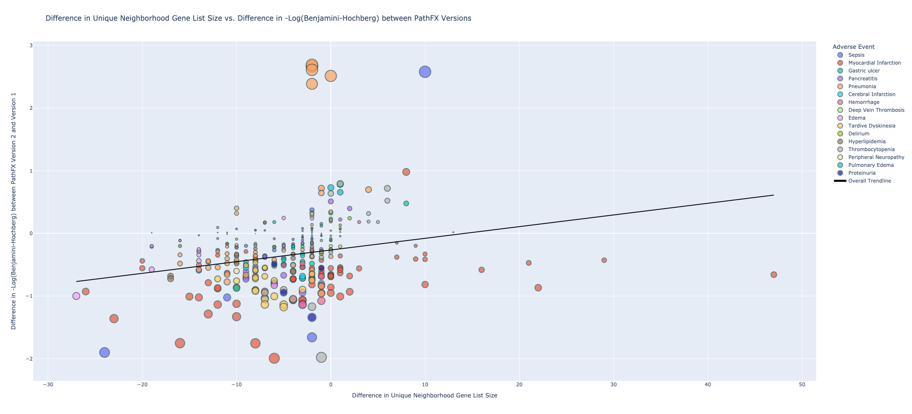
   
   

[**Figure (X).**](https://htmlpreview.github.io/?https://github.com/aryastark5/web_bench/blob/gh-pages/display_files/output_numerical_attributes_assessment/two_versions_numerical_attributes_vs_neg_logBH_/Difference_in_Neighborhood_Gene_List_Size_vs._Difference_in_-Log_Benjamini-Hochberg_between_PathFX_Versions.html)
   

   
   

[**Figure (X).**](https://htmlpreview.github.io/?https://github.com/aryastark5/web_bench/blob/gh-pages/display_files/output_numerical_attributes_assessment/two_versions_numerical_attributes_vs_neg_logBH_/Difference_in_Intersecting_Neighborhood_Gene_List_Percentage_vs._Difference_in_-Log_Benjamini-Hochberg_between_PathFX_Versions.html)
   
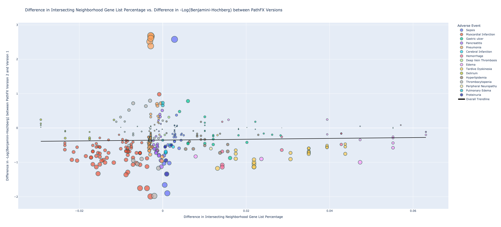
   
   

[**Figure (X).**](https://htmlpreview.github.io/?https://github.com/aryastark5/web_bench/blob/gh-pages/display_files/output_numerical_attributes_assessment/two_versions_numerical_attributes_vs_neg_logBH_/Difference_in_NonNeighborhood_Gene_List_Size_vs._Difference_in_-Log_Benjamini-Hochberg_between_PathFX_Versions.html)
   
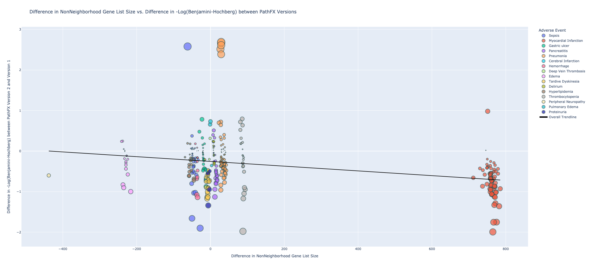
   
   

[**Figure (X).**](https://htmlpreview.github.io/?https://github.com/aryastark5/web_bench/blob/gh-pages/display_files/output_numerical_attributes_assessment/two_versions_numerical_attributes_vs_neg_logBH_/Set_Symmetric_Difference_in_Interactome_Gene_List_Size__vs._Difference_in_-Log_Benjamini-Hochberg_between_PathFX_Versions.html)
   
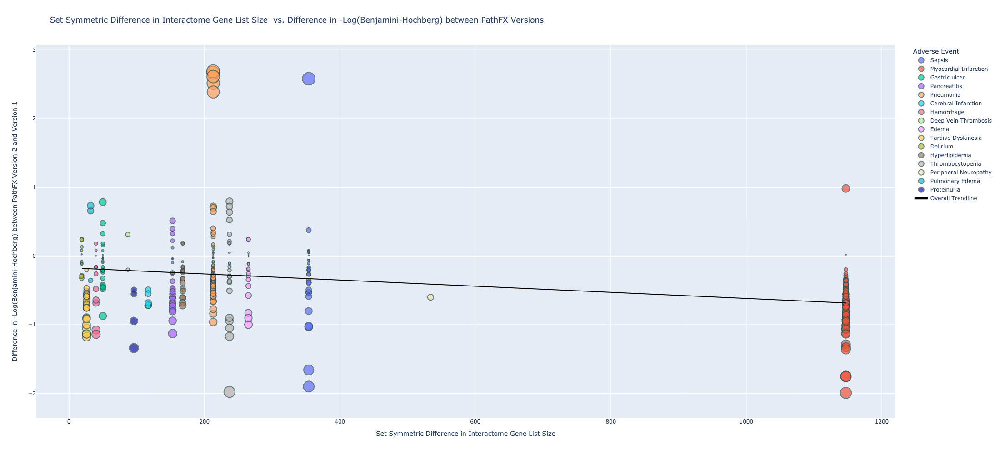
   
   

[**Figure (X).**](https://htmlpreview.github.io/?https://github.com/aryastark5/web_bench/blob/gh-pages/display_files/output_numerical_attributes_assessment/two_versions_numerical_attributes_vs_neg_logBH_/Difference_in_Unique_Interactome_Gene_List_vs._Difference_in_-Log_Benjamini-Hochberg_between_PathFX_Versions.html)
   

   
   

[**Figure (X).**](https://htmlpreview.github.io/?https://github.com/aryastark5/web_bench/blob/gh-pages/display_files/output_numerical_attributes_assessment/two_versions_numerical_attributes_vs_neg_logBH_/Difference_in_Interactome_Gene_List_Size_vs._Difference_in_-Log_Benjamini-Hochberg_between_PathFX_Versions.html)
   
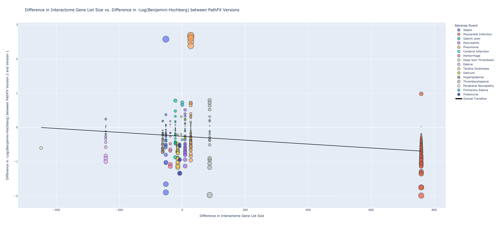
   
   

[**Figure (X).**](https://htmlpreview.github.io/?https://github.com/aryastark5/web_bench/blob/gh-pages/display_files/output_numerical_attributes_assessment/two_versions_numerical_attributes_vs_neg_logBH_/Difference_in_intersecting_Drug_Target_Gene_List_Percentage_vs._Difference_in_-Log_Benjamini-Hochberg_between_PathFX_Versions.html)
   
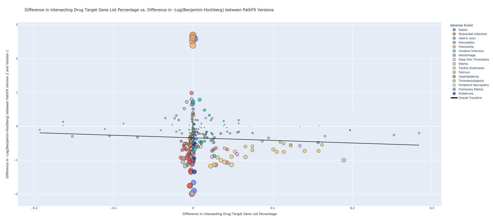
   
   

[**Figure (X).**](https://htmlpreview.github.io/?https://github.com/aryastark5/web_bench/blob/gh-pages/display_files/output_numerical_attributes_assessment/two_versions_numerical_attributes_vs_neg_logBH_/Difference_in_Unique_Interactome_Gene_List_Percentage_vs._Difference_in_-Log_Benjamini-Hochberg_between_PathFX_Versions.html)
   
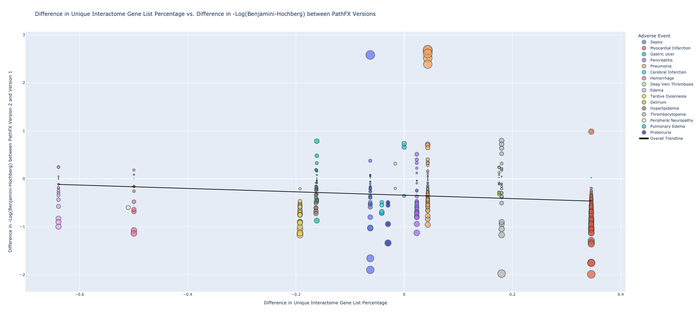
   
   

[**Figure (X).**](https://htmlpreview.github.io/?https://github.com/aryastark5/web_bench/blob/gh-pages/display_files/output_numerical_attributes_assessment/two_versions_numerical_attributes_vs_neg_logBH_/Difference_in_intersecting_Interactome_Gene_List_Percentage_vs._Difference_in_-Log_Benjamini-Hochberg_between_PathFX_Versions.html)
   
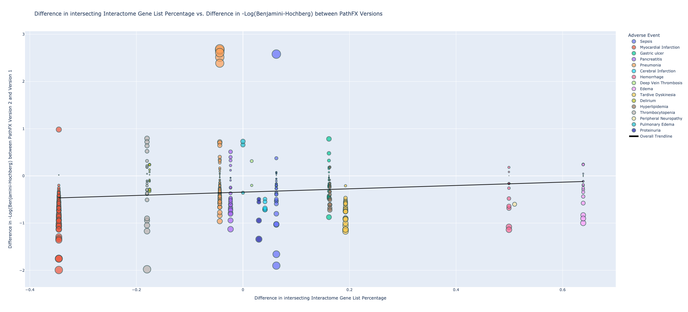
   
   

[**Figure (X).**](https://htmlpreview.github.io/?https://github.com/aryastark5/web_bench/blob/gh-pages/display_files/output_numerical_attributes_assessment/two_versions_numerical_attributes_vs_neg_logBH_/Difference_in_Unique_Drug_Target_Gene_List_Size_vs._Difference_in_-Log_Benjamini-Hochberg_between_PathFX_Versions.html)
   
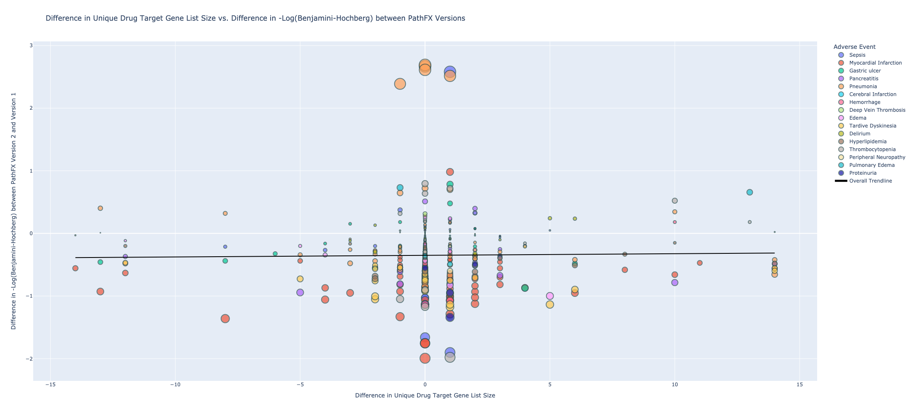
   
   

[**Figure (X).**](https://htmlpreview.github.io/?https://github.com/aryastark5/web_bench/blob/gh-pages/display_files/output_numerical_attributes_assessment/two_versions_numerical_attributes_vs_neg_logBH_/Difference_in_Drug_Target_Gene_List_Size_vs._Difference_in_-Log_Benjamini-Hochberg_between_PathFX_Versions.html)
   
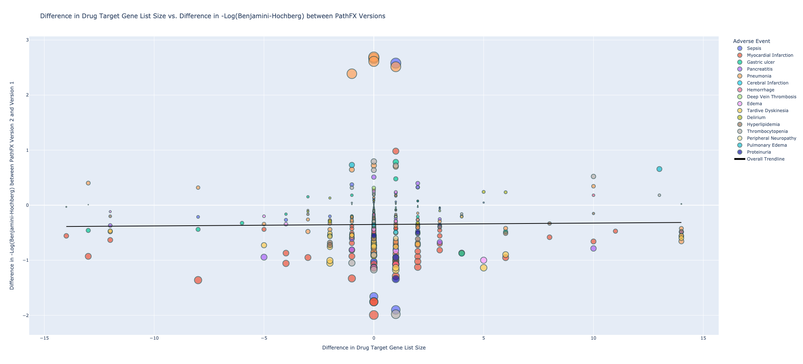
   
   

