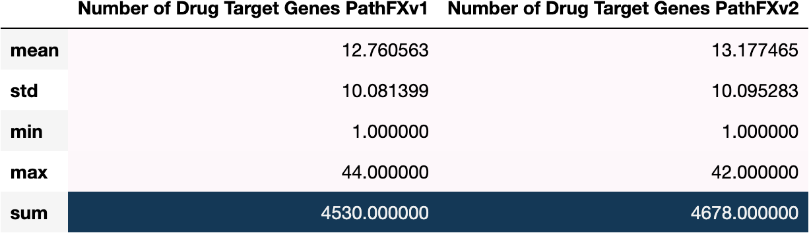
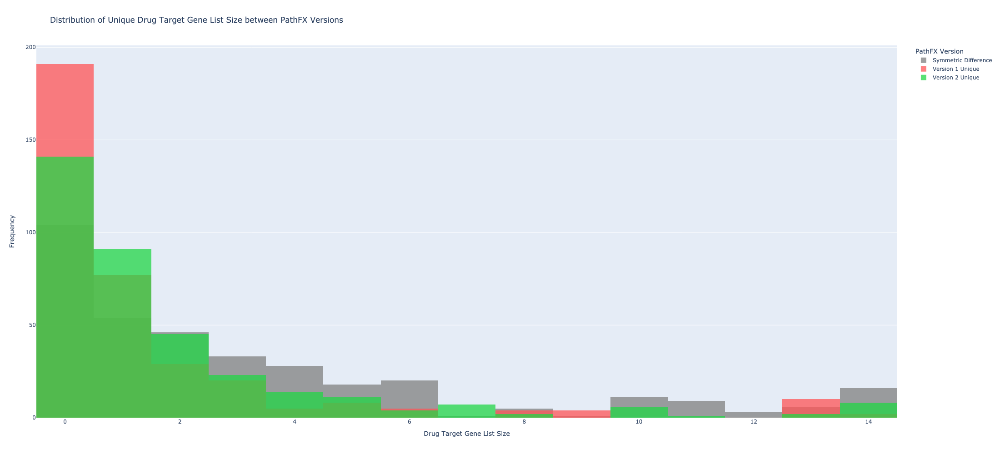
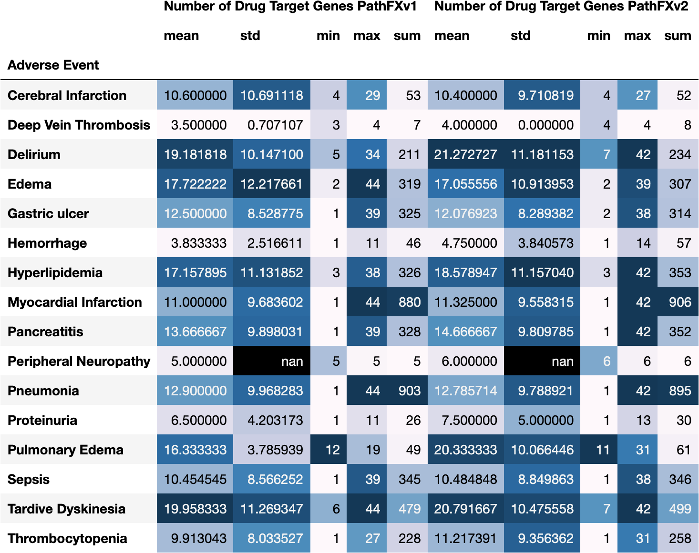
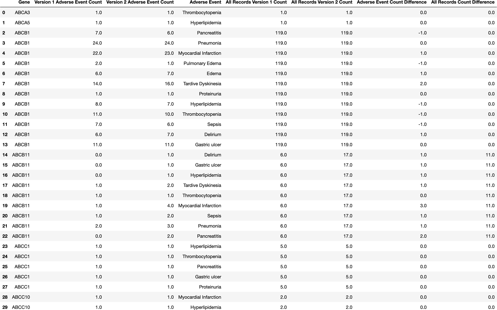
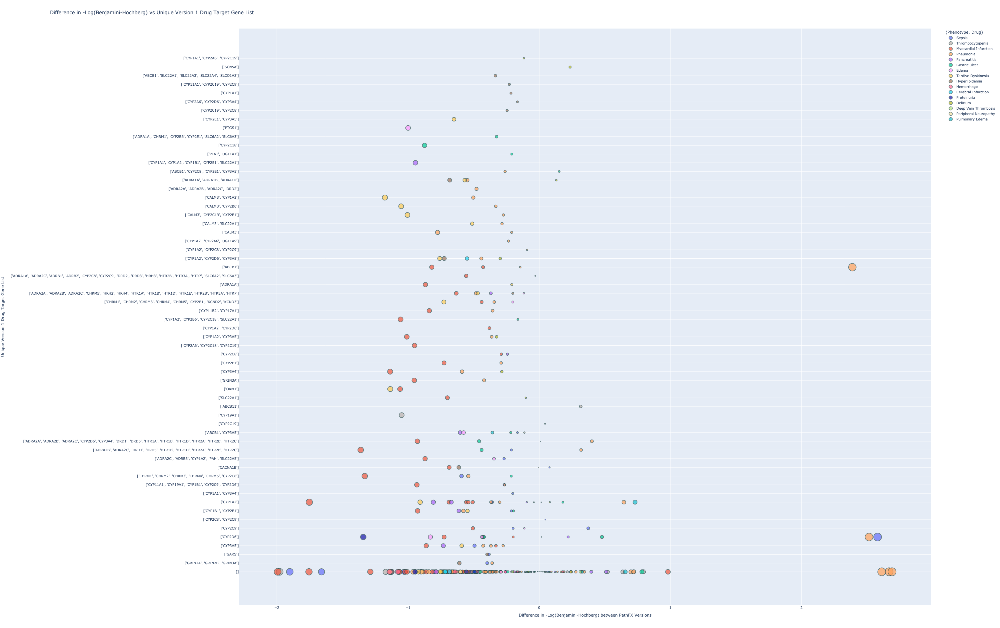
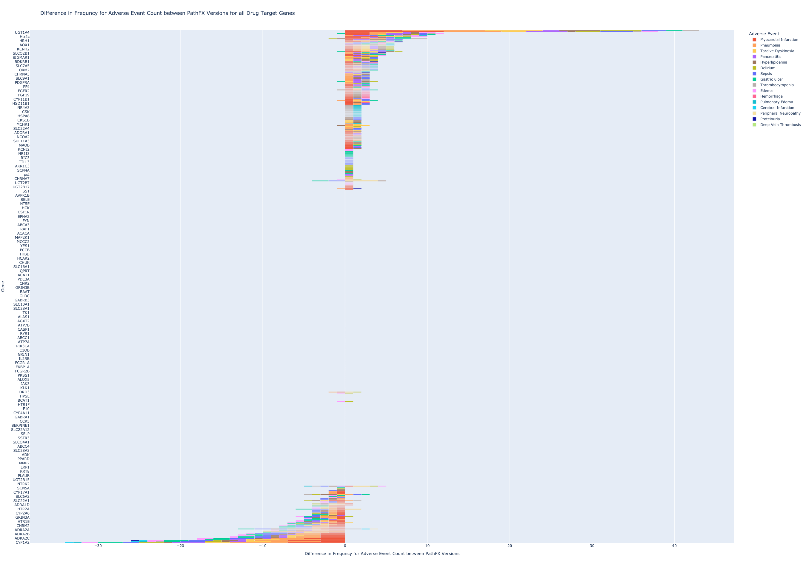
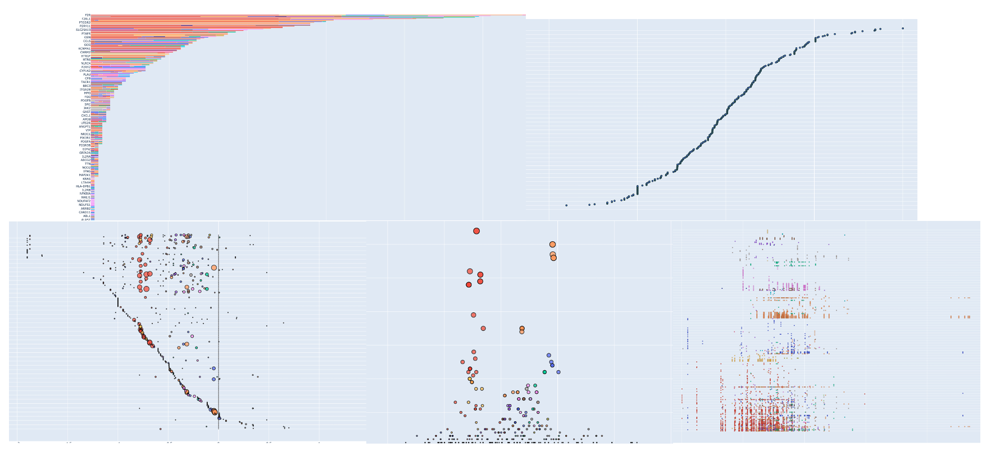

## Numerical Gene List Size Summary   
---------------------------------------------------------------------------
   

[**Table (X). Drug Target Gene List Size Stats Across all records**](https://github.com/aryastark5/web_bench/blob/gh-pages/display_files/drug_target_gene_content_pathfx_version_comparison_info_folder/all_records_drug_target_gene_stats_table.csv)
   

   
   
[**Figure (X). Distribution of Drug Target Gene List Size between PathFX Versions**](https://htmlpreview.github.io/?https://github.com/aryastark5/web_bench/blob/gh-pages/display_files/drug_target_gene_content_pathfx_version_comparison_info_folder/Distribution_of_Drug_Target_Gene_List_Size_between_PathFX_Versions.html)
   

   
   

[**Figure (X). Distribution of Unique Drug Target Gene List Size between PathFX Versions**](https://htmlpreview.github.io/?https://github.com/aryastark5/web_bench/blob/gh-pages/display_files/drug_target_gene_content_pathfx_version_comparison_info_folder/Distribution_of_Unique_Drug_Target_Gene_List_Size_between_PathFX_Versions.html)
   

   
   

[**Table (X). Number of Drug Target Genes Stats for each Adverse Event in PathFX Version 1 and Version 2**](https://github.com/aryastark5/web_bench/blob/gh-pages/display_files/drug_target_gene_content_pathfx_version_comparison_info_folder/num_drug_target_genes_stats_table.csv)
   

   
   

[**Table (X). Drug Target Gene Frequency for Each Adverse Event Info Table**](https://github.com/aryastark5/web_bench/blob/gh-pages/display_files/drug_target_gene_content_pathfx_version_comparison_info_folder/drug_target_genes_version_count_info_table.csv)
   

   
   
   

## Gene List Content Summary   
---------------------------------------------------------------------------
   

### General Comparison between PathFX Version 1.0 and 2.0
   

[**Figure (X). Difference in -Log(BH) vs Unique Version 1 Drug Target Gene List**](https://htmlpreview.github.io/?https://github.com/aryastark5/web_bench/blob/gh-pages/display_files/drug_target_gene_content_pathfx_version_comparison_info_folder/Difference_in_-Log_Benjamini-Hochberg_vs_Unique_Version_1_Drug_Target_Gene_List.html)
   

   
   

[**Figure (X). Difference in -Log(BH) vs Unique Version 2 Drug Target Gene List**](https://htmlpreview.github.io/?https://github.com/aryastark5/web_bench/blob/gh-pages/display_files/drug_target_gene_content_pathfx_version_comparison_info_folder/Difference_in_-Log_Benjamini-Hochberg_vs_Unique_Version_1_Drug_Target_Gene_List.html)
 

   
   

[**Figure (X). Difference in Frequncy for Adverse Event Count between PathFX Versions for all Drug Target Genes**](https://htmlpreview.github.io/?https://github.com/aryastark5/web_bench/blob/gh-pages/display_files/drug_target_gene_content_pathfx_version_comparison_info_folder/version_gene_count_comparison/Difference_in_Frequncy_for_Adverse_Event_Count_between_PathFX_Versions_for_all_Drug_Target_Genes.html)
   

   
   
   

### Gene Content Freqeuncy for Specific set of PathFX Version(s)

   

#### PathFX Version 1.0 

[**Figure (X). Drug Target Genes Frequency**](https://htmlpreview.github.io/?https://github.com/aryastark5/web_bench/blob/gh-pages/display_files/drug_target_gene_content_pathfx_version_comparison_info_folder/gene_frequency/drug_target_genes_version_1/drug_target_genes_version_1_Gene_Frequency.html)

[**Figure (X). Difference in -Log(BH) for each individual (Gene, Drug) Record**](https://htmlpreview.github.io/?https://github.com/aryastark5/web_bench/blob/gh-pages/display_files/drug_target_gene_content_pathfx_version_comparison_info_folder/gene_frequency/drug_target_genes_version_1/drug_target_genes_version_1_Difference_in_-log_BH_for_each_individual_Gene-Drug_Record.html)

[**Figure (X). Mean Difference in -Log(BH) for each Gene Across it's Records**](https://htmlpreview.github.io/?https://github.com/aryastark5/web_bench/blob/gh-pages/display_files/drug_target_gene_content_pathfx_version_comparison_info_folder/gene_frequency/drug_target_genes_version_1/drug_target_genes_version_1_Mean_-log_BH_Difference_of_a_Gene_across_all_records.html)

[**Figure (X). Mean Difference in -Log(BH) for each Adverse Event**](https://htmlpreview.github.io/?https://github.com/aryastark5/web_bench/blob/gh-pages/display_files/drug_target_gene_content_pathfx_version_comparison_info_folder/gene_frequency/drug_target_genes_version_1/drug_target_genes_version_1_Mean_-log_BH_Difference_of_a_Gene_for_a_specific_Adverse_Event.html)

[**Figure (X). Mean Difference in -Log(BH) vs. Frequency of Gene in an Adverse Event**](https://htmlpreview.github.io/?https://github.com/aryastark5/web_bench/blob/gh-pages/display_files/drug_target_gene_content_pathfx_version_comparison_info_folder/gene_frequency/drug_target_genes_version_1/drug_target_genes_version_1_Mean_-log_BH_Difference_vs_Adverse_Event_Count_of_a_specific_Gene.html) 
   
   

#### PathFX Version 1.0 Only

[**Figure (X). Drug Target Genes Frequency**](https://htmlpreview.github.io/?https://github.com/aryastark5/web_bench/blob/gh-pages/display_files/drug_target_gene_content_pathfx_version_comparison_info_folder/gene_frequency/drug_target_genes_version_1_only/drug_target_genes_version_1_only_Gene_Frequency.html)

[**Figure (X). Difference in -Log(BH) for each individual (Gene, Drug) Record**](https://htmlpreview.github.io/?https://github.com/aryastark5/web_bench/blob/gh-pages/display_files/drug_target_gene_content_pathfx_version_comparison_info_folder/gene_frequency/drug_target_genes_version_1_only/drug_target_genes_version_1_only_Difference_in_-log_BH_for_each_individual_Gene-Drug_Record.html)

[**Figure (X). Mean Difference in -Log(BH) for each Gene Across it's Records**](https://htmlpreview.github.io/?https://github.com/aryastark5/web_bench/blob/gh-pages/display_files/drug_target_gene_content_pathfx_version_comparison_info_folder/gene_frequency/drug_target_genes_version_1_only/drug_target_genes_version_1_only_Mean_-log_BH_Difference_of_a_Gene_across_all_records.html)

[**Figure (X). Mean Difference in -Log(BH) for each Adverse Event**](https://htmlpreview.github.io/?https://github.com/aryastark5/web_bench/blob/gh-pages/display_files/drug_target_gene_content_pathfx_version_comparison_info_folder/gene_frequency/drug_target_genes_version_1_only/drug_target_genes_version_1_only_Mean_-log_BH_Difference_of_a_Gene_for_a_specific_Adverse_Event.html)

[**Figure (X). Mean Difference in -Log(BH) vs. Frequency of Gene in an Adverse Event**](https://htmlpreview.github.io/?https://github.com/aryastark5/web_bench/blob/gh-pages/display_files/drug_target_gene_content_pathfx_version_comparison_info_folder/gene_frequency/drug_target_genes_version_1_only/drug_target_genes_version_1_only_Mean_-log_BH_Difference_vs_Adverse_Event_Count_of_a_specific_Gene.html)
   
   

#### PathFX Version 2.0

[**Figure (X). Drug Target Genes Frequency**](https://htmlpreview.github.io/?https://github.com/aryastark5/web_bench/blob/gh-pages/display_files/drug_target_gene_content_pathfx_version_comparison_info_folder/gene_frequency/drug_target_genes_version_2/drug_target_genes_version_2_Gene_Frequency.html)

[**Figure (X). Difference in -Log(BH) for each individual (Gene, Drug) Record**](https://htmlpreview.github.io/?https://github.com/aryastark5/web_bench/blob/gh-pages/display_files/drug_target_gene_content_pathfx_version_comparison_info_folder/gene_frequency/drug_target_genes_version_2/drug_target_genes_version_2_Difference_in_-log_BH_for_each_individual_Gene-Drug_Record.html)

[**Figure (X). Mean Difference in -Log(BH) for each Gene Across it's Records**](https://htmlpreview.github.io/?https://github.com/aryastark5/web_bench/blob/gh-pages/display_files/drug_target_gene_content_pathfx_version_comparison_info_folder/gene_frequency/drug_target_genes_version_2/drug_target_genes_version_2_Mean_-log_BH_Difference_of_a_Gene_across_all_records.html)

[**Figure (X). Mean Difference in -Log(BH) for each Adverse Event**](https://htmlpreview.github.io/?https://github.com/aryastark5/web_bench/blob/gh-pages/display_files/drug_target_gene_content_pathfx_version_comparison_info_folder/gene_frequency/drug_target_genes_version_2/drug_target_genes_version_2_Mean_-log_BH_Difference_of_a_Gene_for_a_specific_Adverse_Event.html)

[**Figure (X). Mean Difference in -Log(BH) vs. Frequency of Gene in an Adverse Event**](https://htmlpreview.github.io/?https://github.com/aryastark5/web_bench/blob/gh-pages/display_files/drug_target_gene_content_pathfx_version_comparison_info_folder/gene_frequency/drug_target_genes_version_2/drug_target_genes_version_2_Mean_-log_BH_Difference_vs_Adverse_Event_Count_of_a_specific_Gene.html)
   
   

#### PathFX Version 2.0 Only

[**Figure (X). Drug Target Genes Frequency**](https://htmlpreview.github.io/?https://github.com/aryastark5/web_bench/blob/gh-pages/display_files/drug_target_gene_content_pathfx_version_comparison_info_folder/gene_frequency/drug_target_genes_version_2_only/drug_target_genes_version_2_only_Gene_Frequency.html)

[**Figure (X). Difference in -Log(BH) for each individual (Gene, Drug) Record**](https://htmlpreview.github.io/?https://github.com/aryastark5/web_bench/blob/gh-pages/display_files/drug_target_gene_content_pathfx_version_comparison_info_folder/gene_frequency/drug_target_genes_version_2_only/drug_target_genes_version_2_only_Difference_in_-log_BH_for_each_individual_Gene-Drug_Record.html)

[**Figure (X). Mean Difference in -Log(BH) for each Gene Across it's Records**](https://htmlpreview.github.io/?https://github.com/aryastark5/web_bench/blob/gh-pages/display_files/drug_target_gene_content_pathfx_version_comparison_info_folder/gene_frequency/drug_target_genes_version_2_only/drug_target_genes_version_2_only_Mean_-log_BH_Difference_of_a_Gene_across_all_records.html)

[**Figure (X). Mean Difference in -Log(BH) for each Adverse Event**](https://htmlpreview.github.io/?https://github.com/aryastark5/web_bench/blob/gh-pages/display_files/drug_target_gene_content_pathfx_version_comparison_info_folder/gene_frequency/drug_target_genes_version_2_only/drug_target_genes_version_2_only_Mean_-log_BH_Difference_of_a_Gene_for_a_specific_Adverse_Event.html)

[**Figure (X). Mean Difference in -Log(BH) vs. Frequency of Gene in an Adverse Event**](https://htmlpreview.github.io/?https://github.com/aryastark5/web_bench/blob/gh-pages/display_files/drug_target_gene_content_pathfx_version_comparison_info_folder/gene_frequency/drug_target_genes_version_2_only/drug_target_genes_version_2_only_Mean_-log_BH_Difference_vs_Adverse_Event_Count_of_a_specific_Gene.html)
   
   

#### PathFX Version 1.0 and 2.0 Intersecting

[**Figure (X). Drug Target Genes Frequency**](https://htmlpreview.github.io/?https://github.com/aryastark5/web_bench/blob/gh-pages/display_files/drug_target_gene_content_pathfx_version_comparison_info_folder/gene_frequency/drug_target_genes_version_1_and_2_intersecting/drug_target_genes_version_1_and_2_intersecting_Gene_Frequency.html)

[**Figure (X). Difference in -Log(BH) for each individual (Gene, Drug) Record**](https://htmlpreview.github.io/?https://github.com/aryastark5/web_bench/blob/gh-pages/display_files/drug_target_gene_content_pathfx_version_comparison_info_folder/gene_frequency/drug_target_genes_version_1_and_2_intersecting/drug_target_genes_version_1_and_2_intersecting_Difference_in_-log_BH_for_each_individual_Gene-Drug_Record.html)

[**Figure (X). Mean Difference in -Log(BH) for each Gene Across it's Records**](https://htmlpreview.github.io/?https://github.com/aryastark5/web_bench/blob/gh-pages/display_files/drug_target_gene_content_pathfx_version_comparison_info_folder/gene_frequency/drug_target_genes_version_1_and_2_intersecting/drug_target_genes_version_1_and_2_intersecting_Mean_-log_BH_Difference_of_a_Gene_across_all_records.html)

[**Figure (X). Mean Difference in -Log(BH) for each Adverse Event**](https://htmlpreview.github.io/?https://github.com/aryastark5/web_bench/blob/gh-pages/display_files/drug_target_gene_content_pathfx_version_comparison_info_folder/gene_frequency/drug_target_genes_version_1_and_2_intersecting/drug_target_genes_version_1_and_2_intersecting_Mean_-log_BH_Difference_of_a_Gene_for_a_specific_Adverse_Event.html)

[**Figure (X). Mean Difference in -Log(BH) vs. Frequency of Gene in an Adverse Event**](https://htmlpreview.github.io/?https://github.com/aryastark5/web_bench/blob/gh-pages/display_files/drug_target_gene_content_pathfx_version_comparison_info_folder/gene_frequency/drug_target_genes_version_1_and_2_intersecting/drug_target_genes_version_1_and_2_intersecting_Mean_-log_BH_Difference_vs_Adverse_Event_Count_of_a_specific_Gene.html)
   
   

#### PathFX Version 1.0 and 2.0 Symmetric Difference

[**Figure (X). Drug Target Genes Frequency**](https://htmlpreview.github.io/?https://github.com/aryastark5/web_bench/blob/gh-pages/display_files/drug_target_gene_content_pathfx_version_comparison_info_folder/gene_frequency/drug_target_genes_version_1_and_2_symmetric_difference/drug_target_genes_version_1_and_2_symmetric_difference_Gene_Frequency.html)

[**Figure (X). Difference in -Log(BH) for each individual (Gene, Drug) Record**](https://htmlpreview.github.io/?https://github.com/aryastark5/web_bench/blob/gh-pages/display_files/drug_target_gene_content_pathfx_version_comparison_info_folder/gene_frequency/drug_target_genes_version_1_and_2_symmetric_difference/drug_target_genes_version_1_and_2_symmetric_difference_Difference_in_-log_BH_for_each_individual_Gene-Drug_Record.html)

[**Figure (X). Mean Difference in -Log(BH) for each Gene Across it's Records**](https://htmlpreview.github.io/?https://github.com/aryastark5/web_bench/blob/gh-pages/display_files/drug_target_gene_content_pathfx_version_comparison_info_folder/gene_frequency/drug_target_genes_version_1_and_2_symmetric_difference/drug_target_genes_version_1_and_2_symmetric_difference_Mean_-log_BH_Difference_of_a_Gene_across_all_records.html)

[**Figure (X). Mean Difference in -Log(BH) for each Adverse Event**](https://htmlpreview.github.io/?https://github.com/aryastark5/web_bench/blob/gh-pages/display_files/drug_target_gene_content_pathfx_version_comparison_info_folder/gene_frequency/drug_target_genes_version_1_and_2_symmetric_difference/drug_target_genes_version_1_and_2_symmetric_difference_Mean_-log_BH_Difference_of_a_Gene_for_a_specific_Adverse_Event.html)

[**Figure (X). Mean Difference in -Log(BH) vs. Frequency of Gene in an Adverse Event**](https://htmlpreview.github.io/?https://github.com/aryastark5/web_bench/blob/gh-pages/display_files/drug_target_gene_content_pathfx_version_comparison_info_folder/gene_frequency/drug_target_genes_version_1_and_2_symmetric_difference/drug_target_genes_version_1_and_2_symmetric_difference_Mean_-log_BH_Difference_vs_Adverse_Event_Count_of_a_specific_Gene.html)
   

