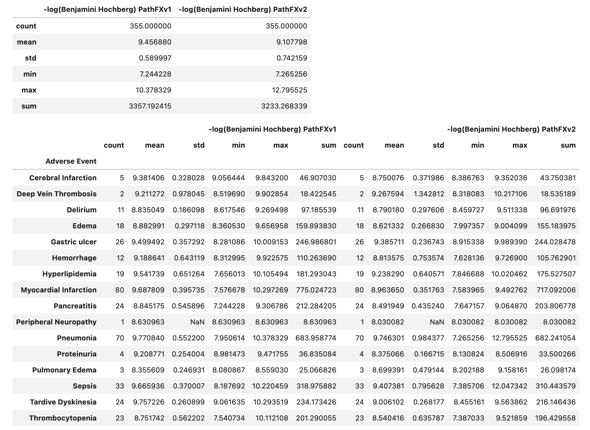
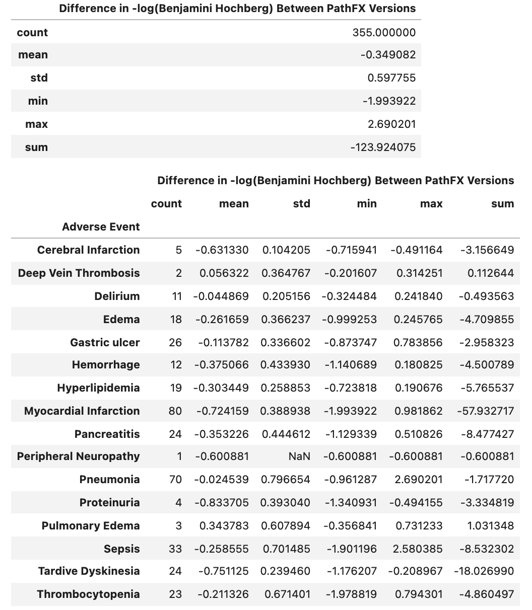
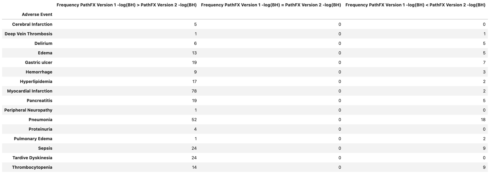
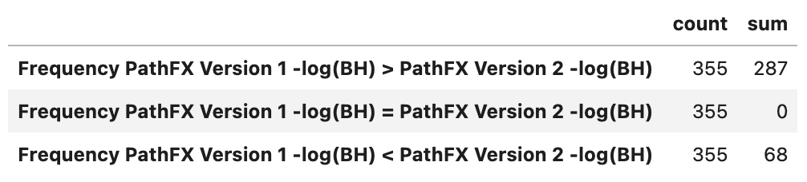

## General Summary info  

Below is a general summary of the results of the 

### FDA Drugs Labeled for Adverse Event (FDLAE) File

Number of Adverse Events listed: 34
Number of Adverse events with identifiable CUIs: 26

Number of ingredients (identified Drugs and others): 1970
Number of Identified DrugBank Drugs: 1759

### PathFX Version 1 and Version 2 (PathFX Benchmark) DataFrame

Number of (CUI, Drug) Records: 1881
Number of unique CUIs: 5583
Number of unique Phenotypes in PathFX Version 1: 7373
Number of unique Phenotypes in PathFX Version 2: 7515
Number of unique DrugBank IDs: 1738
Number of unique Drugs: 1743

Number of (CUI, Drug) Records Associated in PathFX Version 1: 403347
Number of (CUI, Drug) Records Associated in PathFX Version 2: 340554
Number of (CUI, Drug) Records Associated in Both PathFX Versions: 157183

### Intersection of FDA Drugs Labeled for Adverse Event (FDLAE) File and PathFX Benchmark DataFrame (with intersection of Version 1 and 2 associated records) 

Number of (CUI, Drug) Records: 355
Number of unique CUIs: 16
Number of unique Phenotypes in PathFX Version 1: 16
Number of unique Phenotypes in PathFX Version 2: 16
Number of unique DrugBank IDs: 195
Number of unique Drugs: 195

Number of (CUI, Drug) Records Associated in PathFX Version 1: 355
Number of (CUI, Drug) Records Associated in PathFX Version 2: 355
Number of (CUI, Drug) Records Associated in Both PathFX Versions: 355

### Supported Figures 

[test](https://htmlpreview.github.io/?https://github.com/aryastark5/web_bench/blob/gh-pages/display_files/benchmark_general_results/tables/test.html)

**Table Info on Comparing the Distribution of the Difference in -log(Benjamini Hochberg) between PathFX Version 2 and Version 1** 

**Table Info on Comparing the Distribution of the Difference in -log(Benjamini Hochberg) between PathFX Version 2 and Version 1**

**Table Comparing -log(Benjamini Hochberg) Greater Value in PathFX Version 2 vs. Version 1** 

Graphs

[Difference in -log(Benjamini Hochberg) between Version 2 and Version 1 of PathFX for each CUI-Drug Record](https://htmlpreview.github.io/?https://github.com/aryastark5/web_bench/blob/gh-pages/display_files/benchmark_general_results/graphs/one.html)

[Difference in -log(Benjamini Hochberg) between Version 2 and Version 1 of PathFX for each CUI-Drug Record](https://htmlpreview.github.io/?https://github.com/aryastark5/web_bench/blob/gh-pages/display_files/benchmark_general_results/graphs/two.html)

[-log(Benjamini Hochberg Version 1) vs -log(Benjamini Hochberg Version 2)](https://htmlpreview.github.io/?https://github.com/aryastark5/web_bench/blob/gh-pages/display_files/benchmark_general_results/graphs/three.html)

[Distribution of Neighborhood Gene List Size between PathFX Versions](https://htmlpreview.github.io/?https://github.com/aryastark5/web_bench/blob/gh-pages/display_files/benchmark_general_results/graphs/four.html)

[Difference in -log(Benjamini Hochberg) between PathFX Version 2 and Version 1 per CUI](https://htmlpreview.github.io/?https://github.com/aryastark5/web_bench/blob/gh-pages/display_files/benchmark_general_results/graphs/five.html)

[Mean Difference in -log(Benjamini Hochberg) between Version 2 and Version 1 of PathFX for each Drug](https://htmlpreview.github.io/?https://github.com/aryastark5/web_bench/blob/gh-pages/display_files/benchmark_general_results/graphs/six.html)

[Mean Difference in -log(Benjamini Hochberg) between Version 2 and Version 1 of PathFX for Phenotype](https://htmlpreview.github.io/?https://github.com/aryastark5/web_bench/blob/gh-pages/display_files/benchmark_general_results/graphs/seven.html)

