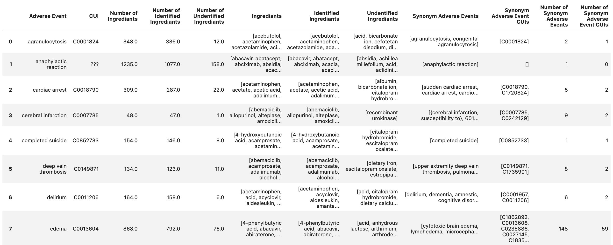
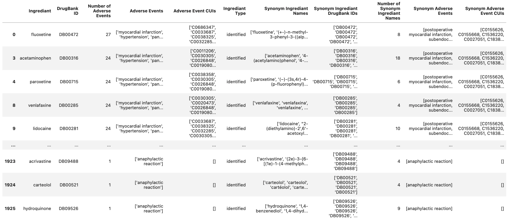
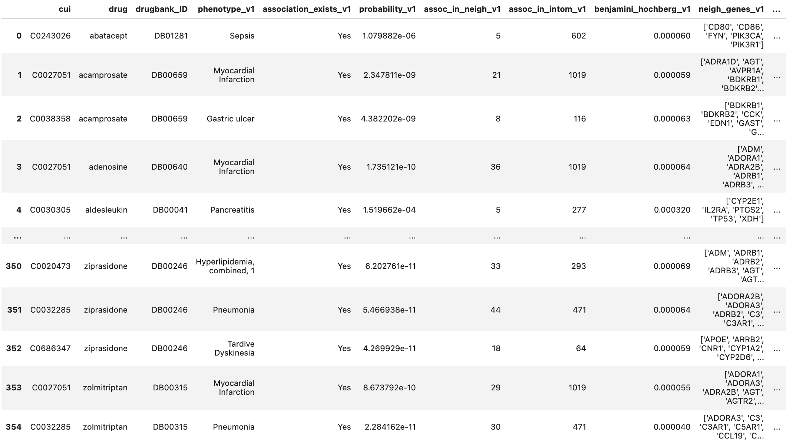
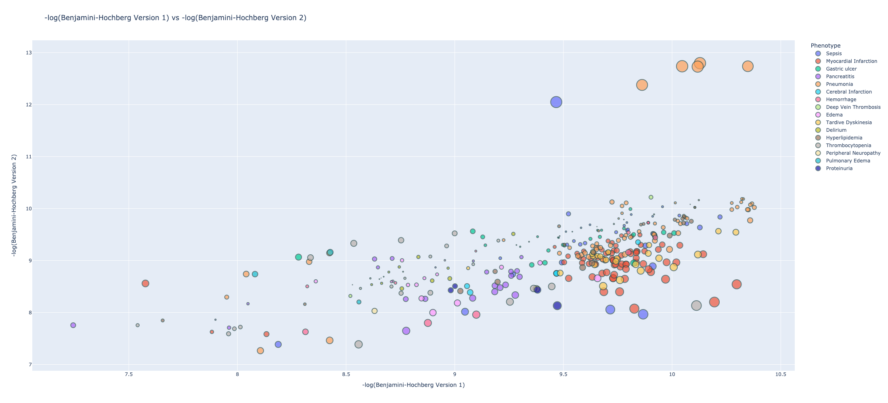
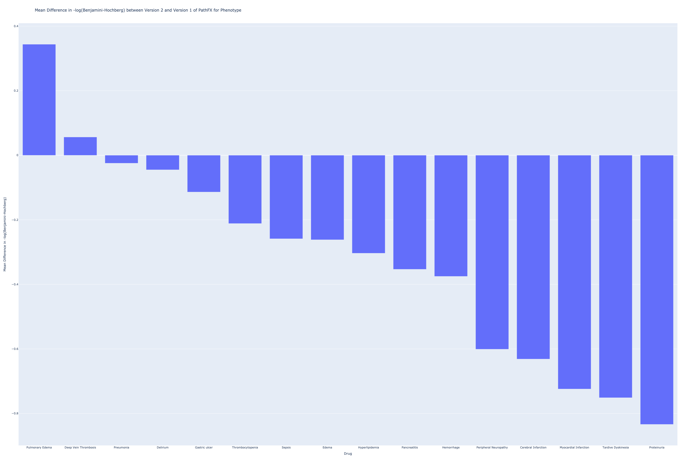

## General Summary   

Below is a general summary of the results after comparing PathFX Version 1.0 and Version 2.0.

### FDA Drugs Labeled for Adverse Event (FDLAE) File

- Number of Adverse Events listed: 34 
- Number of Adverse events with identifiable CUIs: 26 
- Number of ingredients (identified Drugs and others): 1970 
- Number of Identified DrugBank Drugs: 1759 

Source File: [FDA Drugs Labeled for Adverse Event (FDLAE) File](https://drive.google.com/file/d/1_2a8m1ehTjmnd_b0_dxRmh-Ir7R4NO3Q/view?usp=sharing)
\
\
**Table 1. Drug-adverse event reactions extracted from drug labels.** Side effects from drug labels, their associated PathFX synonyms and CUI terms as well as all ingredients and ingredients mapped to DrugBank identifiers are described above 

Source File: [Drug-adverse event reactions extracted from drug labels](https://drive.google.com/file/d/1vqrlwiJaUjHq8j0J92sLwRIakopeanS1/view?usp=sharing)
\
\
**Supplement Figure 1. Table of Identified Ingredients** PathFX Version 1 and Version 2 both shared 2054 unique drugs listed in their interaction files

Source File: [Table of Identified Ingredients](https://drive.google.com/file/d/1fydAgRB_Vll63KYPROtJsK7peQdZadMp/view?usp=sharing)
\

\
### PathFX Version 1 and Version 2 (PathFX Benchmark) DataFrame

- Number of (CUI, Drug) Records: 1881 
- Number of unique CUIs: 5583 
- Number of unique Phenotypes in PathFX Version 1: 7373 
- Number of unique Phenotypes in PathFX Version 2: 7515 
- Number of unique DrugBank IDs: 1738 
- Number of unique Drugs: 1743 

- Number of (CUI, Drug) Records Associated in PathFX Version 1: 403347 
- Number of (CUI, Drug) Records Associated in PathFX Version 2: 340554 
- Number of (CUI, Drug) Records Associated in Both PathFX Versions: 157183 
\

**Table 3. Benchmark DataFrame for PathFX Version 1.0 and 2.0** Merged PathFX analysis for shared drugs identified side-effect related phenotypes and reported phenotype-associated genes in drug networks.

Source File: (Please Contact Lab for more information)
\
\
### Intersection of FDA Drugs Labeled for Adverse Event (FDLAE) File and PathFX Benchmark DataFrame (with intersection of Version 1 and 2 associated records) 

- Number of (CUI, Drug) Records: 355 
- Number of unique CUIs: 16 
- Number of unique Phenotypes in PathFX Version 1: 16 
- Number of unique Phenotypes in PathFX Version 2: 16 
- Number of unique DrugBank IDs: 195 
- Number of unique Drugs: 195 

- Number of (CUI, Drug) Records Associated in PathFX Version 1: 355 
- Number of (CUI, Drug) Records Associated in PathFX Version 2: 355 
- Number of (CUI, Drug) Records Associated in Both PathFX Versions: 355 

/
/
/

## Benjamini-Hochberg

- Number of times Version 1 had higher -Log(Benjamini-Hochberg) value: 287.0
- Number of times Version 2 had higher -Log(Benjamini-Hochberg) value: 68.0
- Number of times Version 1 and Version 2 had same -Log(Benjamini-Hochberg) value: 0.0
\

**Figure (X).** [Distribution of -Log(Benjamini-Hochberg) values shown across all (CUI, Drug) records for Pathv1 and PathFXv2]
(https://htmlpreview.github.io/?https://github.com/aryastark5/web_bench/blob/gh-pages/display_files/benchmark_general_results/graphs/distribution_-log_bh_both_ver.html)

\

**Figure (X).** [Scatterplot comparing the values of -Log(Benjamin Hochberg) for PathFXv1 against PathFXv2]
(https://htmlpreview.github.io/?https://github.com/aryastark5/web_bench/blob/gh-pages/display_files/benchmark_general_results/graphs/-log_bh_v1_vs_-log_bh_v2.html)

\

**Figure (X).** [Waterfall plot of Difference in -Log(Benjamini-Hochberg) between PathFX Versions across all (CUI, Drug) records for Pathv1 and PathFXv2]
(https://htmlpreview.github.io/?https://github.com/aryastark5/web_bench/blob/gh-pages/display_files/benchmark_general_results/graphs/log_bh_waterfall_plot.html)

\

**Figure (X).** [Waterfall plot of Mean Difference in -Log(Benjamini-Hochberg) between PathFX Versions across all Phenotypes for Pathv1 and PathFXv2e]
(https://htmlpreview.github.io/?https://github.com/aryastark5/web_bench/blob/gh-pages/display_files/benchmark_general_results/graphs/-log_bh_adverse_event_waterfall_plot.html)

\

**Figure (X).** [Distribution of Difference in -Log(Benjamin Hochberg) for each 16 unique adverse events]
(https://htmlpreview.github.io/?https://github.com/aryastark5/web_bench/blob/gh-pages/display_files/benchmark_general_results/graphs/distribution_difference_-log_bh_per_adverse_event.html)

