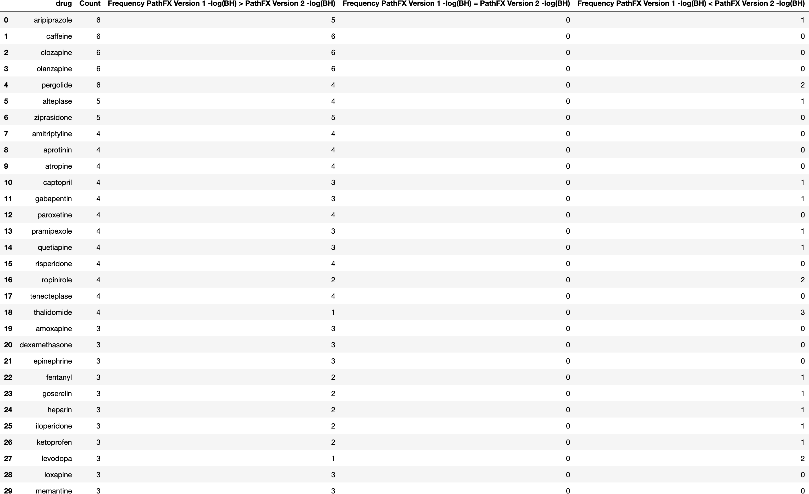

# General Benchmark Results
{: .no_toc }

## Table of contents
{: .no_toc .text-delta }

1. TOC
{:toc}
   

## General Summary   
---------------------------------------------------------------------------
Below is a general summary of the results after comparing PathFX Version 1.0 and Version 2.0.
   
   

### FDA Drugs Labeled for Adverse Event (FDLAE) File
- Number of Adverse Events listed: 34 
- Number of Adverse events with identifiable CUIs: 26 
- Number of ingredients (identified Drugs and others): 1970 
- Number of Identified DrugBank Drugs: 1759 
   
[**Supplement File (X). FDA Drugs Labeled for Adverse Event (FDLAE) File**](https://github.com/aryastark5/web_bench/blob/gh-pages/display_files/source_files/Drugs_labeled_for_AEs.txt)
   

   
[**Table 1. Drug-adverse event reactions extracted from drug labels**](https://github.com/aryastark5/web_bench/blob/gh-pages/display_files/source_files/adverse_events_with_synonyms_and_ingrediant_info_table.csv) Side effects from drug labels, their associated PathFX synonyms and CUI terms as well as all ingredients and ingredients mapped to DrugBank identifiers are described above
   

   
[**Supplement Figure 1. Table of Identified Ingredients**](https://github.com/aryastark5/web_bench/blob/gh-pages/display_files/source_files/ingrediants_table.csv) PathFX Version 1 and Version 2 both shared 2054 unique drugs listed in their interaction files
   

   
   
 
### PathFX Version 1 and Version 2 (PathFX Benchmark) DataFrame
- Number of (CUI, Drug) Records: 1881 
- Number of unique CUIs: 5583 
- Number of unique Phenotypes in PathFX Version 1: 7373 
- Number of unique Phenotypes in PathFX Version 2: 7515 
- Number of unique DrugBank IDs: 1738 
- Number of unique Drugs: 1743 
- Number of (CUI, Drug) Records Associated in PathFX Version 1: 403347 
- Number of (CUI, Drug) Records Associated in PathFX Version 2: 340554 
- Number of (CUI, Drug) Records Associated in Both PathFX Versions: 157183  
   

### Intersection of FDA Drugs Labeled for Adverse Event (FDLAE) File and PathFX Benchmark DataFrame (with intersection of Version 1 and 2 associated records)
- Number of (CUI, Drug) Records: 355 
- Number of unique CUIs: 16 
- Number of unique Phenotypes in PathFX Version 1: 16 
- Number of unique Phenotypes in PathFX Version 2: 16 
- Number of unique DrugBank IDs: 195 
- Number of unique Drugs: 195 
- Number of (CUI, Drug) Records Associated in PathFX Version 1: 355 
- Number of (CUI, Drug) Records Associated in PathFX Version 2: 355 
- Number of (CUI, Drug) Records Associated in Both PathFX Versions: 355  
   

**Table 3. Benchmark DataFrame for PathFX Version 1.0 and 2.0** Merged PathFX analysis for shared drugs identified side-effect related phenotypes and reported phenotype-associated genes in drug networks. (For more information about this data, please contact the lab)
   

   
   
 
## Benjamini-Hochberg
---------------------------------------------------------------------------
Below is a summary of the differences between PathFX Version 1.0 and 2.0 in regards to the Benjamini-Hochberg value.
   
   

### Score Size Comparison between PathFX Versions
   
 
[**Table (X). Frequency of -Log(Benjamini-Hochberg) value comparison between PathFX Versions across all (CUI, Drug) records**](https://github.com/aryastark5/web_bench/blob/gh-pages/display_files/output_benchmark_general_results/bh_inequa_comp_table.csv)
   

   
[**Table (X). Frequency of -Log(Benjamini-Hochberg) value comparison between PathFX Versions across all Adverse Events**](https://github.com/aryastark5/web_bench/blob/gh-pages/display_files/output_benchmark_general_results/bh_inequa_adverse_event_comp_table.csv)
   

   
[**Table (X). Table (X). Frequency of -Log(Benjamini-Hochberg) value comparison between PathFX Versions across all Drugs (Top 30 shown)**](https://github.com/aryastark5/web_bench/blob/gh-pages/display_files/output_benchmark_general_results/drug_bh_assoc_version_table.csv)
   
 
   
   

### Distribution of Values for each PathFX Version
- Number of times Version 1 had higher -Log(Benjamini-Hochberg) value: 287.0
- Number of times Version 2 had higher -Log(Benjamini-Hochberg) value: 68.0
- Number of times Version 1 and Version 2 had same -Log(Benjamini-Hochberg) value: 0.0
   

[**Table (X). -Log(Benjamini-Hochberg) Statistic summary between PathFX Versions**](https://github.com/aryastark5/web_bench/blob/gh-pages/display_files/output_benchmark_general_results/bh_all_records_stats_table.csv)
   

   
[**Table (X). -Log(Benjamini-Hochberg) Statistic summary for Specific Adverse events between PathFX Versions**](https://github.com/aryastark5/web_bench/blob/gh-pages/display_files/output_benchmark_general_results/bh_per_adverse_event_stats_table.csv)
   

   
[**Figure (X). Distribution of -Log(Benjamini-Hochberg) values shown across all (CUI, Drug) records for Pathv1 and PathFXv2**](https://htmlpreview.github.io/?https://github.com/aryastark5/web_bench/blob/gh-pages/display_files/output_benchmark_general_results/Distribution_of_-Log_Benjamini-Hochberg_between_PathFX_Versions.html)
   

   
[**Figure (X). Scatterplot comparing the values of -Log(Benjamin Hochberg) for PathFXv1 against PathFXv2**](https://htmlpreview.github.io/?https://github.com/aryastark5/web_bench/blob/gh-pages/display_files/output_benchmark_general_results/-log_Benjamini-Hochberg_Version_1_vs_-log_Benjamini-Hochberg_Version_2.html)
   

   
   

### Difference in Values between the PathFX Versions
   
 
[**Table (X). Difference in -Log(Benjamini-Hochberg) Statistic summary between PathFX Versions**](https://github.com/aryastark5/web_bench/blob/gh-pages/display_files/output_benchmark_general_results/diff_bh_all_records_stats_table.csv)
   

   
[**Table (X). Difference in -Log(Benjamini-Hochberg) Statistic summary for Specific Adverse events between PathFX Versions**](https://github.com/aryastark5/web_bench/blob/gh-pages/display_files/output_benchmark_general_results/diff_bh_per_adverse_event_stats_table.csv)
   

   
[**Figure (X). Distribution of Difference in -Log(Benjamin Hochberg) for each 16 unique adverse events**](https://htmlpreview.github.io/?https://github.com/aryastark5/web_bench/blob/gh-pages/display_files/output_benchmark_general_results/Difference_in_-Log_Benjamini-Hochberg_between_PathFX_Version_2_and_Version_1_per_CUI.html)
   

   
[**Figure (X). Waterfall plot of Difference in -Log(Benjamini-Hochberg) between PathFX Versions across all (CUI, Drug) records for Pathv1 and PathFXv2**](https://htmlpreview.github.io/?https://github.com/aryastark5/web_bench/blob/gh-pages/display_files/output_benchmark_general_results/Difference_in_-Log_Benjamini-Hochberg_between_Version_2_and_Version_1_of_PathFX_for_each_CUI-Drug_Record.html)
   

   
[**Figure (X). Waterfall plot of Mean Difference in -Log(Benjamini-Hochberg) between PathFX Versions across all Phenotypes for Pathv1 and PathFXv2e**](https://htmlpreview.github.io/?https://github.com/aryastark5/web_bench/blob/gh-pages/display_files/output_benchmark_general_results/Mean_Difference_in_-Log_Benjamini-Hochberg_between_Version_2_and_Version_1_of_PathFX_for_Phenotype.html)
   

   
[**Figure (X). Waterfall plot of Mean Difference in -Log(Benjamini-Hochberg) between PathFX Versions across all Drugs for Pathv1 and PathFXv2e**](https://htmlpreview.github.io/?https://github.com/aryastark5/web_bench/blob/gh-pages/display_files/output_benchmark_general_results/Mean_Difference_in_-Log_Benjamini-Hochberg_between_Version_2_and_Version_1_of_PathFX_for_each_Drug.html)
   

 
 
 

