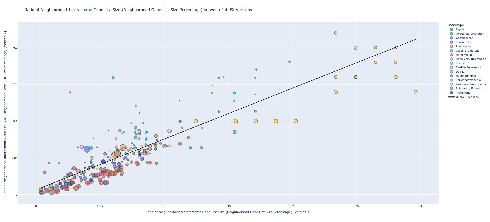
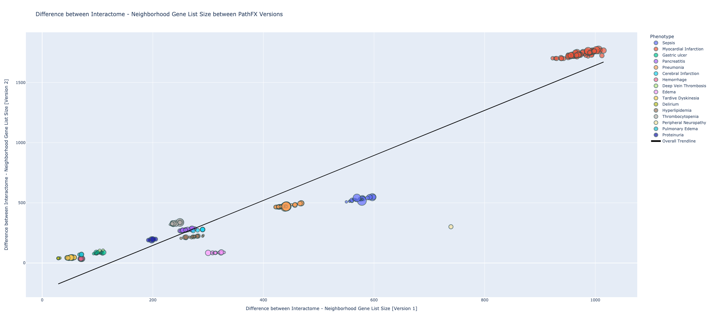
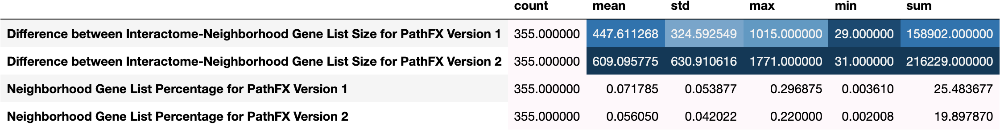
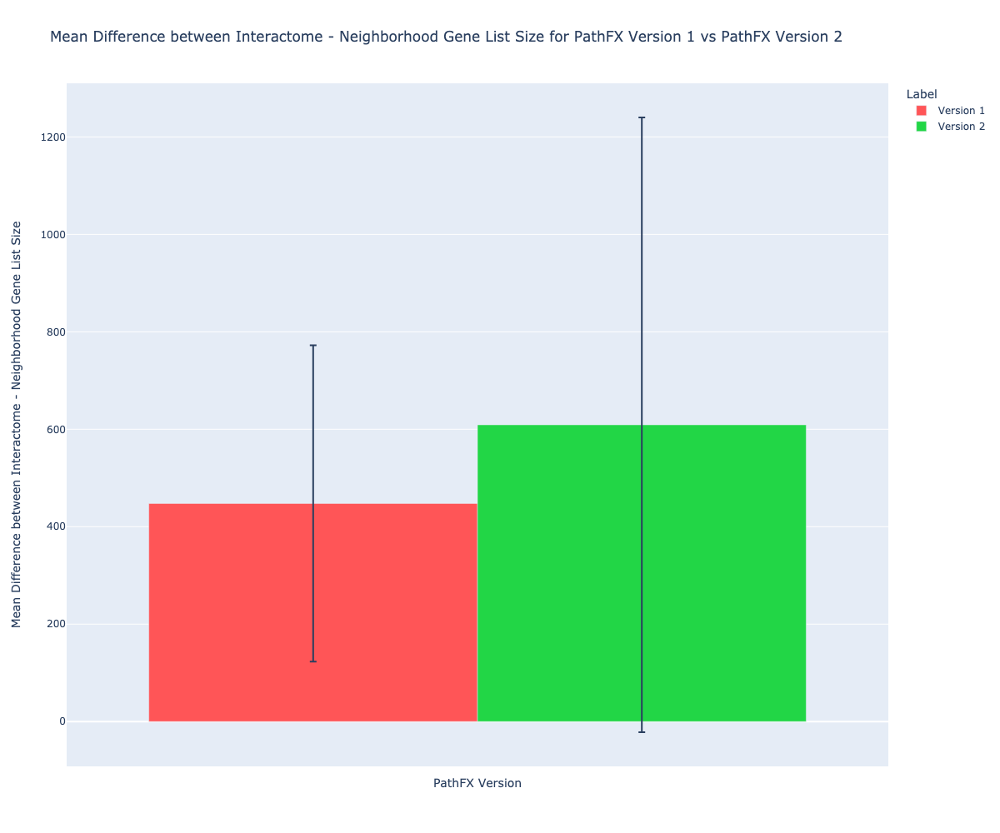
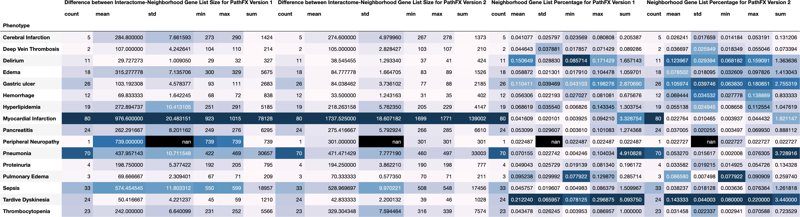
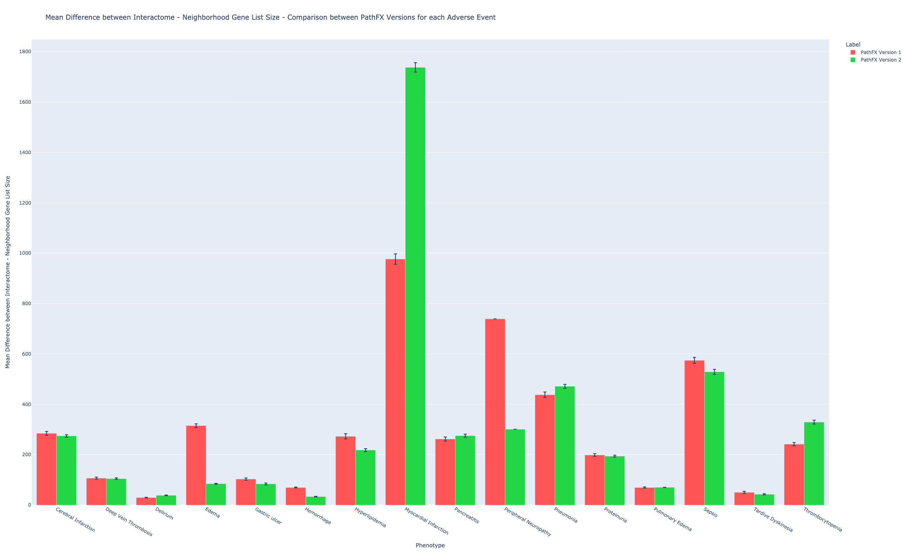
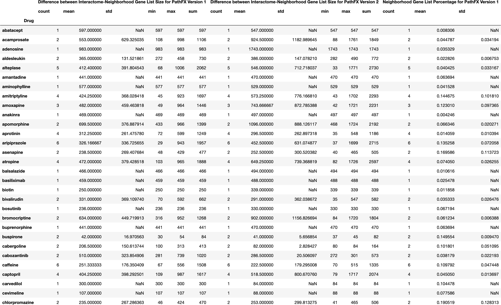
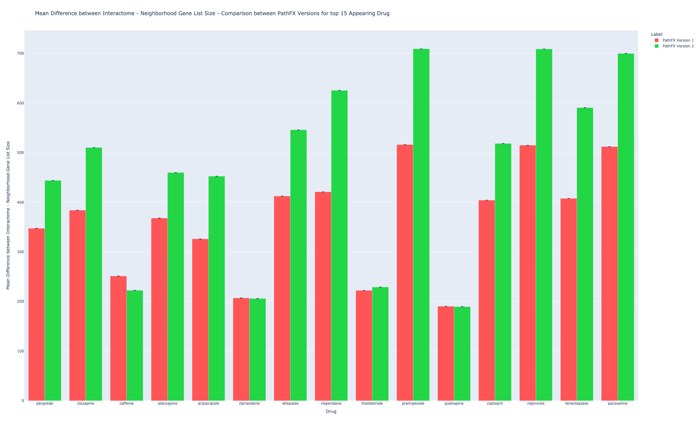

## Scatterplots

[**Figure (X).**](https://htmlpreview.github.io/?https://github.com/aryastark5/web_bench/blob/gh-pages/display_files/mean_and_ratio_neigh_with_intom_gene/Ratio_of_Neighborhood|Interactome_Gene_List_Size__Neighborhood_Gene_List_Size_Percentage_between_PathFX_Versions.html)
   

   
   

[**Figure (X).**](https://htmlpreview.github.io/?https://github.com/aryastark5/web_bench/blob/gh-pages/display_files/mean_and_ratio_neigh_with_intom_gene/Difference_between_Interactome_-_Neighborhood_Gene_List_Size_between_PathFX_Versions.html)
   

   
   

## Tables and Barchart

### All Records

[**Table (X).**](https://htmlpreview.github.io/?https://github.com/aryastark5/web_bench/blob/gh-pages/display_files/mean_and_ratio_neigh_with_intom_gene/ratio_and_difference_of_neigh_and_intom_stats_table.csv)
   

   
   

[**Figure (X).**](https://htmlpreview.github.io/?https://github.com/aryastark5/web_bench/blob/gh-pages/display_files/mean_and_ratio_neigh_with_intom_gene/Mean_Difference_between_Interactome_-_Neighborhood_Gene_List_Size_for_PathFX_Version_1_vs_PathFX_Version_2.html)
   

   
   

[**Figure (X).**](https://htmlpreview.github.io/?https://github.com/aryastark5/web_bench/blob/gh-pages/display_files/mean_and_ratio_neigh_with_intom_gene/Mean_Ratio_of_Neighborhood|Interactome_Gene_List_Size__Mean_Neighborhood_Gene_List_Size_Percentage_between_PathFX_Versions.html)
   

   
   

### Per Phenotype

[**Table (X).**](https://htmlpreview.github.io/?https://github.com/aryastark5/web_bench/blob/gh-pages/display_files/mean_and_ratio_neigh_with_intom_gene/ratio_and_difference_of_neigh_and_intom_per_adverse_event_stats_table.csv)
   

   
   

[**Figure (X).**](https://htmlpreview.github.io/?https://github.com/aryastark5/web_bench/blob/gh-pages/display_files/mean_and_ratio_neigh_with_intom_gene/Mean_Difference_between_Interactome_-_Neighborhood_Gene_List_Size_-_Comparison_between_PathFX_Versions_for_each_Adverse_Event.html)
   

   
   

[**Figure (X).**](https://htmlpreview.github.io/?https://github.com/aryastark5/web_bench/blob/gh-pages/display_files/mean_and_ratio_neigh_with_intom_gene/Mean_Ratio_between_Neighborhood|Interactome_Gene_List_Size_-_Comparison_between_PathFX_Versions_for_each_Adverse_Event.html)
   

   
   

### Per Drug

[**Table (X).**](https://htmlpreview.github.io/?https://github.com/aryastark5/web_bench/blob/gh-pages/display_files/mean_and_ratio_neigh_with_intom_gene/ratio_and_difference_of_neigh_and_intom_per_drug_stats_table.csv)
   

   
   

[**Figure (X).**](https://htmlpreview.github.io/?https://github.com/aryastark5/web_bench/blob/gh-pages/display_files/mean_and_ratio_neigh_with_intom_gene/Mean_Difference_between_Interactome_-_Neighborhood_Gene_List_Size_-_Comparison_between_PathFX_Versions_for_top_15_Appearing_Drug.html)
   

   
   

[**Figure (X).**](https://htmlpreview.github.io/?https://github.com/aryastark5/web_bench/blob/gh-pages/display_files/mean_and_ratio_neigh_with_intom_gene/Mean_Ratio_between_Neighborhood|Interactome_Gene_List_Size_-_Comparison_between_PathFX_Versions_for_each_top_15_Appearing_Drug.html)
   

   
   

