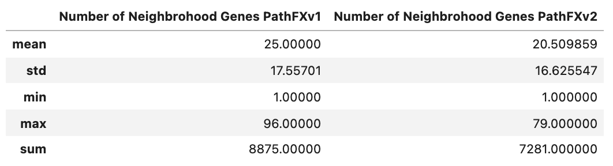
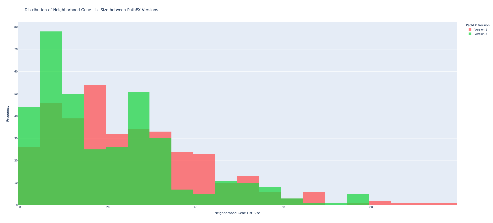
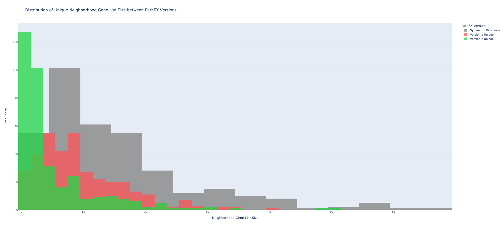
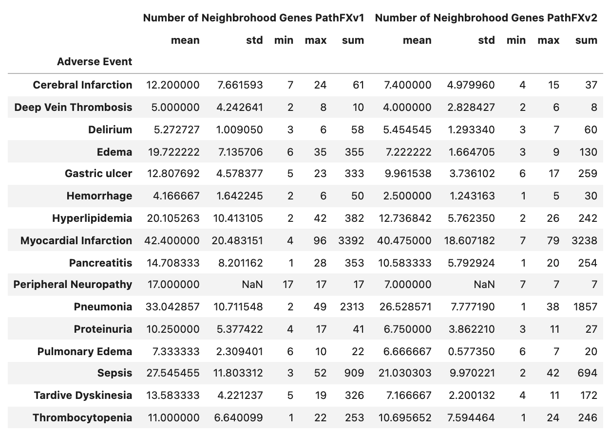
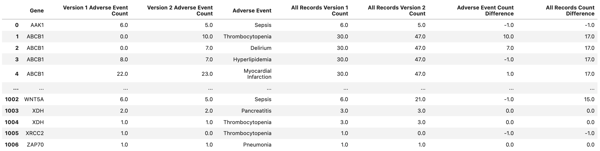

## General

**Table (X).** [Neighborhood Gene List Size Stats Across all records](https://drive.google.com/file/d/1d2oIL_lxWuKhaMtlgMbG65pr4HpKWMOk/view?usp=sharing)

**Figure (X).** [Distribution of Neighborhood Gene List Size between PathFX Versions](https://htmlpreview.github.io/?https://github.com/aryastark5/web_bench/blob/gh-pages/display_files/neighborhood_genes_results/graphs/Distribution of Neighborhood Gene List Size between PathFX Versions.html)

**Figure (X).** [Distribution of Unique Neighborhood Gene List Size between PathFX Versions](https://htmlpreview.github.io/?https://github.com/aryastark5/web_bench/blob/gh-pages/display_files/neighborhood_genes_results/graphs/Distribution of Unique eighborhood Gene List Size between PathFX Versions.html)

**Table (X).** [Number of Neighborhood Genes Stats for each Adverse Event in PathFX Version 1 and Version 2]()

**Table (X).** [Neighborhood Gene Frequency for Each Adverse Event Info Table](https://drive.google.com/file/d/1li_yg1bKwIsaVFT6lggGwW9EExWflnMs/view?usp=sharing)

### Gene Content

[Difference in -LogBH vs Unique Version 1 Neighborhood Gene List](https://htmlpreview.github.io/?https://github.com/aryastark5/web_bench/blob/gh-pages/display_files/neighborhood_genes_results/graphs/Difference in -LogBH vs Unique Version 1 Neighborhood Gene List.html)

[Difference in -LogBH vs Unique Version 2 Neighborhood Gene List](https://htmlpreview.github.io/?https://github.com/aryastark5/web_bench/blob/gh-pages/display_files/neighborhood_genes_results/graphs/Difference in -LogBH vs Unique Version 2 Neighborhood Gene List.html)

[Difference in Frequncy for Adverse Event Count between PathFX Versions for all Neighborhood Genes](https://htmlpreview.github.io/?https://github.com/aryastark5/web_bench/blob/gh-pages/display_files/neighborhood_genes_results/graphs/Difference in Frequncy for Adverse Event Count between PathFX Versions for all Neighborhood Genes.html)

