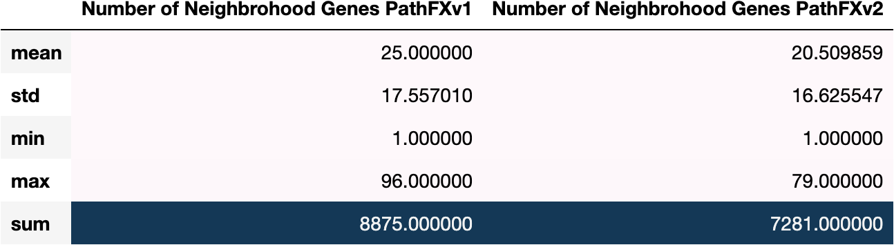

## Numerical Gene List Size Summary   
---------------------------------------------------------------------------
<br\>
 

[**Table (X). Neighborhood Gene List Size Stats Across all records**](https://github.com/aryastark5/web_bench/blob/gh-pages/display_files/neighborhood_gene_content_pathfx_version_comparison_info_folder/all_recrods_neigh_gene_stats_table.csv)

[**Figure (X). Distribution of Neighborhood Gene List Size between PathFX Versions**](https://github.com/aryastark5/web_bench/blob/gh-pages/display_files/neighborhood_gene_content_pathfx_version_comparison_info_folder/Distribution_of_Neighborhood_Gene_List_Size_between_PathFX_Versions.html)
 

 

[**Figure (X). Distribution of Unique Neighborhood Gene List Size between PathFX Versions**](https://github.com/aryastark5/web_bench/blob/gh-pages/display_files/neighborhood_gene_content_pathfx_version_comparison_info_folder/Distribution_of_Unique_Neighborhood_Gene_List_Size_between_PathFX_Versions.html)
 

 
 
[**Table (X). Number of Neighborhood Genes Stats for each Adverse Event in PathFX Version 1 and Version 2**](https://github.com/aryastark5/web_bench/blob/gh-pages/display_files/neighborhood_gene_content_pathfx_version_comparison_info_folder/num_neigh_genes_stats_table.csv)
 

 

[**Table (X). Neighborhood Gene Frequency for Each Adverse Event Info Table**](https://github.com/aryastark5/web_bench/blob/gh-pages/display_files/neighborhood_gene_content_pathfx_version_comparison_info_folder/neigh_genes_version_count_info_table.csv)
 

 
 
 
## Gene List Content Summary   
---------------------------------------------------------------------------
 
### General

[**Figure (X). Difference in -LogBH vs Unique Version 1 Neighborhood Gene List**](https://github.com/aryastark5/web_bench/blob/gh-pages/display_files/neighborhood_gene_content_pathfx_version_comparison_info_folder/Difference_in_-Log_Benjamini-Hochberg_vs_Unique_Version_1_Neighborhood_Gene_List.html)
 

 
 
[**Figure (X). Difference in -LogBH vs Unique Version 2 Neighborhood Gene List**](https://github.com/aryastark5/web_bench/blob/gh-pages/display_files/neighborhood_gene_content_pathfx_version_comparison_info_folder/Difference_in_-Log_Benjamini-Hochberg_vs_Unique_Version_1_Neighborhood_Gene_List.html)
 

 
 
[**Figure (X). Difference in Frequncy for Adverse Event Count between PathFX Versions for all Neighborhood Genes**](display_files/neighborhood_gene_content_pathfx_version_comparison_info_folder/version_gene_count_comparison/Difference_in_Frequncy_for_Adverse_Event_Count_between_PathFX_Versions_for_all_Neighborhood_Genes.html)
 

 
 

### Gene Content Freqeuncy for Specific set of PathFX Version(s)

#### PathFX Version 1.0

[**Figure (X). Neighoborhood Genes Frequency**](https://github.com/aryastark5/web_bench/blob/gh-pages/display_files/neighborhood_gene_content_pathfx_version_comparison_info_folder/gene_frequency/neigh_genes_version_1/neigh_genes_version_1_Gene_Frequency.html)

[**Figure (X). Difference in -log(BH) for each individual (Gene, Drug) Record**](https://github.com/aryastark5/web_bench/blob/gh-pages/display_files/neighborhood_gene_content_pathfx_version_comparison_info_folder/gene_frequency/neigh_genes_version_1/neigh_genes_version_1_Difference_in_-log_BH_for_each_individual_Gene-Drug_Record.html)

[**Figure (X). Mean Difference in -log(BH) for each Gene Across it's Records**](https://github.com/aryastark5/web_bench/blob/gh-pages/display_files/neighborhood_gene_content_pathfx_version_comparison_info_folder/gene_frequency/neigh_genes_version_1/neigh_genes_version_1_Mean_-log_BH_Difference_of_a_Gene_across_all_records.html)

[**Figure (X). Mean Difference in -log(BH) for each Adverse Event**](https://github.com/aryastark5/web_bench/blob/gh-pages/display_files/neighborhood_gene_content_pathfx_version_comparison_info_folder/gene_frequency/neigh_genes_version_1/neigh_genes_version_1_Mean_-log_BH_Difference_of_a_Gene_for_a_specific_Adverse_Event.html)

[**Figure (X). Mean Difference in -log(BH) vs. Frequency of Gene in an Adverse Event**](https://github.com/aryastark5/web_bench/blob/gh-pages/display_files/neighborhood_gene_content_pathfx_version_comparison_info_folder/gene_frequency/neigh_genes_version_1/neigh_genes_version_1_Mean_-log_BH_Difference_vs_Adverse_Event_Count_of_a_specific_Gene.html)

#### PathFX Version 1.0 Only

[**Figure (X). Neighoborhood Genes Frequency**](https://github.com/aryastark5/web_bench/blob/gh-pages/display_files/neighborhood_gene_content_pathfx_version_comparison_info_folder/gene_frequency/neigh_genes_version_1_only/neigh_genes_version_1_only_Gene_Frequency.html)

[**Figure (X). Difference in -log(BH) for each individual (Gene, Drug) Record**](https://github.com/aryastark5/web_bench/blob/gh-pages/display_files/neighborhood_gene_content_pathfx_version_comparison_info_folder/gene_frequency/neigh_genes_version_1_only/neigh_genes_version_1_only_Difference_in_-log_BH_for_each_individual_Gene-Drug_Record.html)

[**Figure (X). Mean Difference in -log(BH) for each Gene Across it's Records**](https://github.com/aryastark5/web_bench/blob/gh-pages/display_files/neighborhood_gene_content_pathfx_version_comparison_info_folder/gene_frequency/neigh_genes_version_1_only/neigh_genes_version_1_only_Mean_-log_BH_Difference_of_a_Gene_across_all_records.html)

[**Figure (X). Mean Difference in -log(BH) for each Adverse Event**](https://github.com/aryastark5/web_bench/blob/gh-pages/display_files/neighborhood_gene_content_pathfx_version_comparison_info_folder/gene_frequency/neigh_genes_version_1_only/neigh_genes_version_1_only_Mean_-log_BH_Difference_of_a_Gene_for_a_specific_Adverse_Event.html)

[**Figure (X). Mean Difference in -log(BH) vs. Frequency of Gene in an Adverse Event**](https://github.com/aryastark5/web_bench/blob/gh-pages/display_files/neighborhood_gene_content_pathfx_version_comparison_info_folder/gene_frequency/neigh_genes_version_1_only/neigh_genes_version_1_only_Mean_-log_BH_Difference_vs_Adverse_Event_Count_of_a_specific_Gene.html)

#### PathFX Version 2.0

[**Figure (X). Neighoborhood Genes Frequency**](https://github.com/aryastark5/web_bench/blob/gh-pages/display_files/neighborhood_gene_content_pathfx_version_comparison_info_folder/gene_frequency/neigh_genes_version_2/neigh_genes_version_2_Gene_Frequency.html)

[**Figure (X). Difference in -log(BH) for each individual (Gene, Drug) Record**](https://github.com/aryastark5/web_bench/blob/gh-pages/display_files/neighborhood_gene_content_pathfx_version_comparison_info_folder/gene_frequency/neigh_genes_version_2/neigh_genes_version_2_Difference_in_-log_BH_for_each_individual_Gene-Drug_Record.html)

[**Figure (X). Mean Difference in -log(BH) for each Gene Across it's Records**](https://github.com/aryastark5/web_bench/blob/gh-pages/display_files/neighborhood_gene_content_pathfx_version_comparison_info_folder/gene_frequency/neigh_genes_version_2/neigh_genes_version_2_Mean_-log_BH_Difference_of_a_Gene_across_all_records.html)

[**Figure (X). Mean Difference in -log(BH) for each Adverse Event**](https://github.com/aryastark5/web_bench/blob/gh-pages/display_files/neighborhood_gene_content_pathfx_version_comparison_info_folder/gene_frequency/neigh_genes_version_2/neigh_genes_version_2_Mean_-log_BH_Difference_of_a_Gene_for_a_specific_Adverse_Event.html)

[**Figure (X). Mean Difference in -log(BH) vs. Frequency of Gene in an Adverse Event**](https://github.com/aryastark5/web_bench/blob/gh-pages/display_files/neighborhood_gene_content_pathfx_version_comparison_info_folder/gene_frequency/neigh_genes_version_2/neigh_genes_version_2_Mean_-log_BH_Difference_vs_Adverse_Event_Count_of_a_specific_Gene.html)

#### PathFX Version 2.0 Only

[**Figure (X). Neighoborhood Genes Frequency**](https://github.com/aryastark5/web_bench/blob/gh-pages/display_files/neighborhood_gene_content_pathfx_version_comparison_info_folder/gene_frequency/neigh_genes_version_2_only/neigh_genes_version_2_only_Gene_Frequency.html)

[**Figure (X). Difference in -log(BH) for each individual (Gene, Drug) Record**](https://github.com/aryastark5/web_bench/blob/gh-pages/display_files/neighborhood_gene_content_pathfx_version_comparison_info_folder/gene_frequency/neigh_genes_version_2_only/neigh_genes_version_2_only_Difference_in_-log_BH_for_each_individual_Gene-Drug_Record.html)

[**Figure (X). Mean Difference in -log(BH) for each Gene Across it's Records**](https://github.com/aryastark5/web_bench/blob/gh-pages/display_files/neighborhood_gene_content_pathfx_version_comparison_info_folder/gene_frequency/neigh_genes_version_2_only/neigh_genes_version_2_only_Mean_-log_BH_Difference_of_a_Gene_across_all_records.html)

[**Figure (X). Mean Difference in -log(BH) for each Adverse Event**](https://github.com/aryastark5/web_bench/blob/gh-pages/display_files/neighborhood_gene_content_pathfx_version_comparison_info_folder/gene_frequency/neigh_genes_version_2_only/neigh_genes_version_2_only_Mean_-log_BH_Difference_of_a_Gene_for_a_specific_Adverse_Event.html)

[**Figure (X). Mean Difference in -log(BH) vs. Frequency of Gene in an Adverse Event**](https://github.com/aryastark5/web_bench/blob/gh-pages/display_files/neighborhood_gene_content_pathfx_version_comparison_info_folder/gene_frequency/neigh_genes_version_2_only/neigh_genes_version_2_only_Mean_-log_BH_Difference_vs_Adverse_Event_Count_of_a_specific_Gene.html)

#### PathFX Version 1.0 and 2.0 Intersecting

[**Figure (X). Neighoborhood Genes Frequency**](https://github.com/aryastark5/web_bench/blob/gh-pages/display_files/neighborhood_gene_content_pathfx_version_comparison_info_folder/gene_frequency/neigh_genes_version_1_and_2_intersecting/neigh_genes_version_1_and_2_intersecting_Gene_Frequency.html)

[**Figure (X). Difference in -log(BH) for each individual (Gene, Drug) Record**](https://github.com/aryastark5/web_bench/blob/gh-pages/display_files/neighborhood_gene_content_pathfx_version_comparison_info_folder/gene_frequency/neigh_genes_version_1_and_2_intersecting/neigh_genes_version_1_and_2_intersecting_Difference_in_-log_BH_for_each_individual_Gene-Drug_Record.html)

[**Figure (X). Mean Difference in -log(BH) for each Gene Across it's Records**](https://github.com/aryastark5/web_bench/blob/gh-pages/display_files/neighborhood_gene_content_pathfx_version_comparison_info_folder/gene_frequency/neigh_genes_version_1_and_2_intersecting/neigh_genes_version_1_and_2_intersecting_Mean_-log_BH_Difference_of_a_Gene_across_all_records.html)

[**Figure (X). Mean Difference in -log(BH) for each Adverse Event**](https://github.com/aryastark5/web_bench/blob/gh-pages/display_files/neighborhood_gene_content_pathfx_version_comparison_info_folder/gene_frequency/neigh_genes_version_1_and_2_intersecting/neigh_genes_version_1_and_2_intersecting_Mean_-log_BH_Difference_of_a_Gene_for_a_specific_Adverse_Event.html)

[**Figure (X). Mean Difference in -log(BH) vs. Frequency of Gene in an Adverse Event**](https://github.com/aryastark5/web_bench/blob/gh-pages/display_files/neighborhood_gene_content_pathfx_version_comparison_info_folder/gene_frequency/neigh_genes_version_1_and_2_intersecting/neigh_genes_version_1_and_2_intersecting_Mean_-log_BH_Difference_vs_Adverse_Event_Count_of_a_specific_Gene.html)

#### PathFX Version 1.0 and 2.0 Symmetric Difference

[**Figure (X). Neighoborhood Genes Frequency**](https://github.com/aryastark5/web_bench/blob/gh-pages/display_files/neighborhood_gene_content_pathfx_version_comparison_info_folder/gene_frequency/neigh_genes_version_1_and_2_symmetric_difference/neigh_genes_version_1_and_2_symmetric_difference_Gene_Frequency.html)

[**Figure (X). Difference in -log(BH) for each individual (Gene, Drug) Record**](https://github.com/aryastark5/web_bench/blob/gh-pages/display_files/neighborhood_gene_content_pathfx_version_comparison_info_folder/gene_frequency/neigh_genes_version_1_and_2_symmetric_difference/neigh_genes_version_1_and_2_symmetric_difference_Difference_in_-log_BH_for_each_individual_Gene-Drug_Record.html)

[**Figure (X). Mean Difference in -log(BH) for each Gene Across it's Records**](https://github.com/aryastark5/web_bench/blob/gh-pages/display_files/neighborhood_gene_content_pathfx_version_comparison_info_folder/gene_frequency/neigh_genes_version_1_and_2_symmetric_difference/neigh_genes_version_1_and_2_symmetric_difference_Mean_-log_BH_Difference_of_a_Gene_across_all_records.html)

[**Figure (X). Mean Difference in -log(BH) for each Adverse Event**](https://github.com/aryastark5/web_bench/blob/gh-pages/display_files/neighborhood_gene_content_pathfx_version_comparison_info_folder/gene_frequency/neigh_genes_version_1_and_2_symmetric_difference/neigh_genes_version_1_and_2_symmetric_difference_Mean_-log_BH_Difference_of_a_Gene_for_a_specific_Adverse_Event.html)

[**Figure (X). Mean Difference in -log(BH) vs. Frequency of Gene in an Adverse Event**](https://github.com/aryastark5/web_bench/blob/gh-pages/display_files/neighborhood_gene_content_pathfx_version_comparison_info_folder/gene_frequency/neigh_genes_version_1_and_2_symmetric_difference/neigh_genes_version_1_and_2_symmetric_difference_Mean_-log_BH_Difference_vs_Adverse_Event_Count_of_a_specific_Gene.html)

