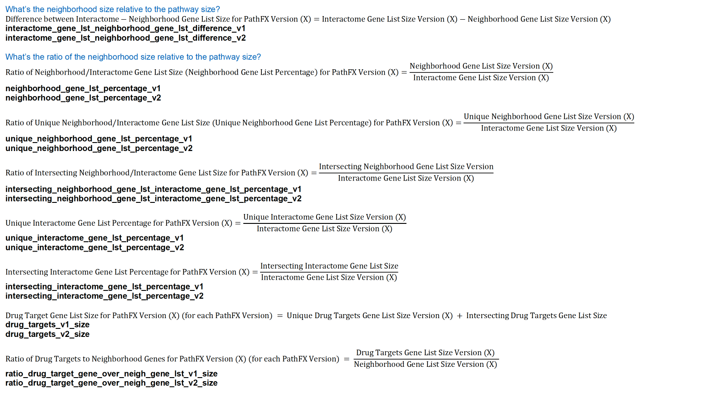

We considered multiple numerical attributes that could descried how different input data could influence strength of PathFX predictions. We were particularly interested in how side-effect-associated genes in drug networks (“neighborhood gene lists”) and how side-effect pathway genes (“interactome gene lists”) changed. We pursued multiple metrics that quantified changes in neighborhood and interactome gene lists **(Table X).**

**Table X.** Numerical attribute quantified changes in underlying PathFX data – specifically changes in neighborhood and interactome gene lists and relationships between these data.

