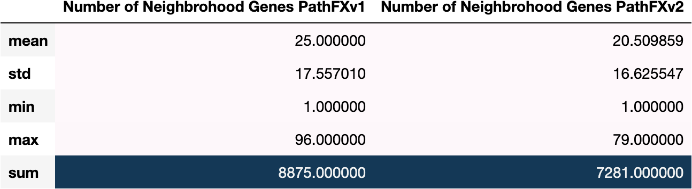

# Numerical Attributes Assessment
{: .no_toc }

## Table of contents
{: .no_toc .text-delta }

1. TOC
{:toc}
   

We considered multiple numerical attributes that could descried how different input data could influence strength of PathFX predictions. We were particularly interested in how side-effect-associated genes in drug networks (“neighborhood gene lists”) and how side-effect pathway genes (“interactome gene lists”) changed. We pursued multiple metrics that quantified changes in neighborhood and interactome gene lists **(Table X).**

**Table X.** Numerical attribute quantified changes in underlying PathFX data – specifically changes in neighborhood and interactome gene lists and relationships between these data.

[**Table (X). Neighborhood Gene List Size Stats Across all records**](https://github.com/aryastark5/web_bench/blob/gh-pages/display_files/neighborhood_gene_content_pathfx_version_comparison_info_folder/all_records_neigh_gene_stats_table.csv)
   

   
   

