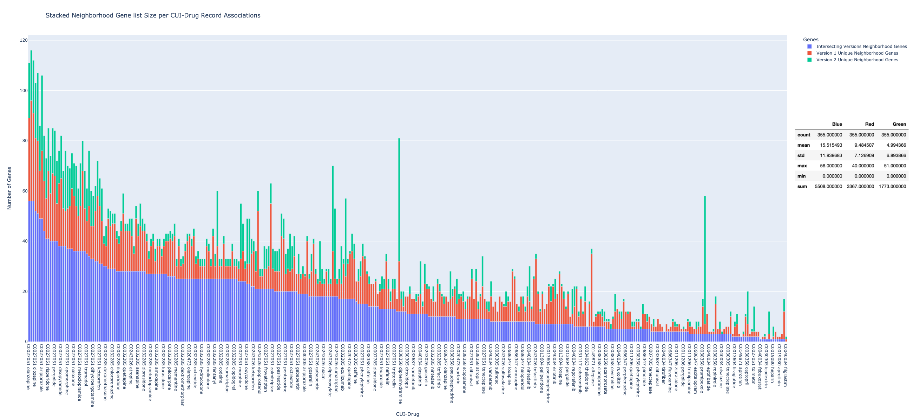
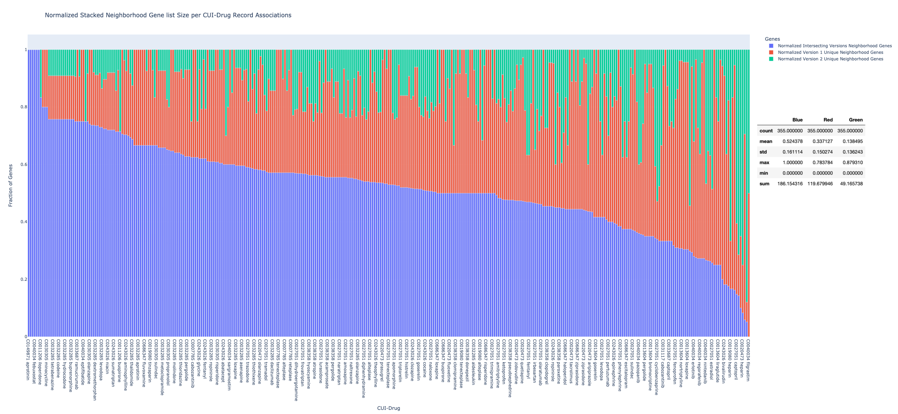
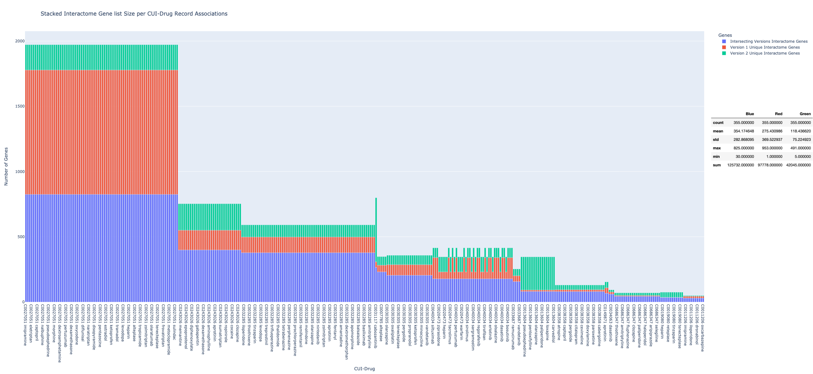
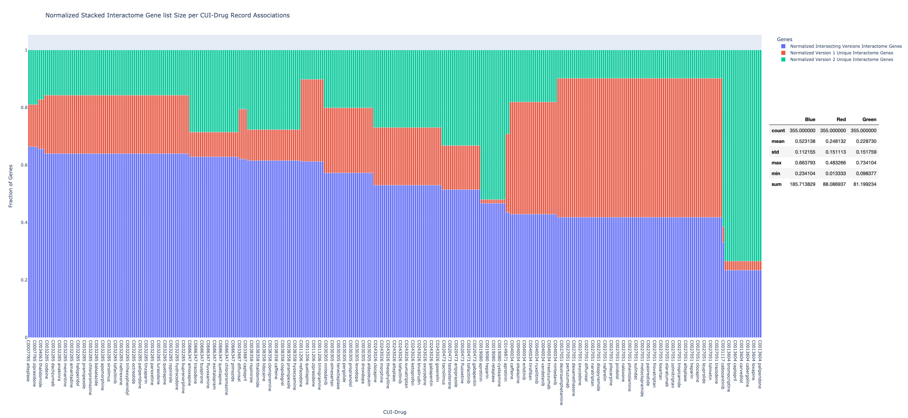
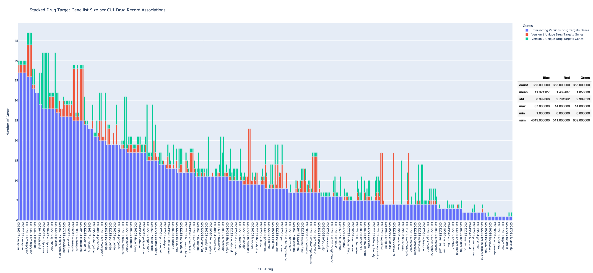
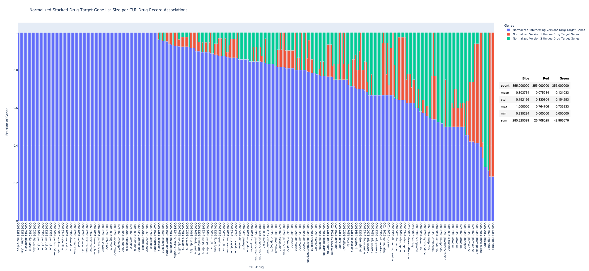
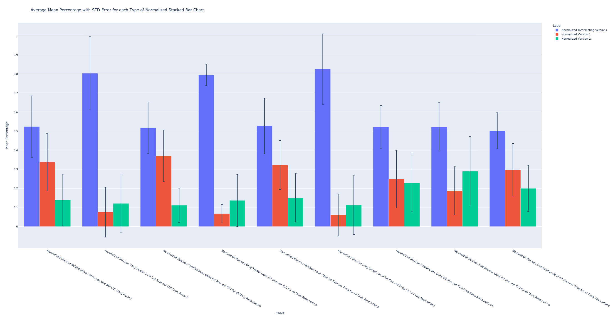

## Every (CUI, Drug)
---------------------------------------------------------------------------
   

### Neighborhood Gene

[**Figure (X).**](https://github.com/aryastark5/web_bench/blob/gh-pages/display_files/output_stacked_bar_chart_analysis/every_cui_drug_record/Stacked_Neighborhood_Gene_list_Size_per_CUI-Drug_Record_Associations.html)
  

  
  

[**Figure (X).**](https://github.com/aryastark5/web_bench/blob/gh-pages/display_files/output_stacked_bar_chart_analysis/every_cui_drug_record/Normalized_Stacked_Neighborhood_Gene_list_Size_per_CUI-Drug_Record_Associations.html)
  

  
  

### Interactome Gene

[**Figure (X).**](https://github.com/aryastark5/web_bench/blob/gh-pages/display_files/output_stacked_bar_chart_analysis/every_cui_drug_record/Stacked_Interactome_Gene_list_Size_per_CUI-Drug_Record_Associations.html)
  

  
  

[**Figure (X).**](https://github.com/aryastark5/web_bench/blob/gh-pages/display_files/output_stacked_bar_chart_analysis/every_cui_drug_record/Normalized_Stacked_Interactome_Gene_list_Size_per_CUI-Drug_Record_Associations.html)
  

  
  

### Drug Target Gene

[**Figure (X).**](https://github.com/aryastark5/web_bench/blob/gh-pages/display_files/output_stacked_bar_chart_analysis/every_cui_drug_record/Stacked_Drug_Target_Gene_list_Size_per_CUI-Drug_Record_Associations.html)
  

  
  

[**Figure (X).**](https://github.com/aryastark5/web_bench/blob/gh-pages/display_files/output_stacked_bar_chart_analysis/every_cui_drug_record/Normalized_Stacked_Drug_Target_Gene_list_Size_per_CUI-Drug_Record_Associations.html)
  

  
  

## Every Phenotype
---------------------------------------------------------------------------
   

## Every Drug
---------------------------------------------------------------------------
   

## Mean of all Normalized Bar Charts
---------------------------------------------------------------------------
   

[**Figure (X). Average Mean Percentage with STD Error for each Type of Normalized Stacked Bar Chart**](https://htmlpreview.github.io/?https://github.com/aryastark5/web_bench/blob/gh-pages/display_files/output_stacked_bar_chart_analysis/Average_Mean_Percentage_with_STD_Error_for_each_Type_of_Normalized_Stacked_Bar_Chart.html)
   

  
