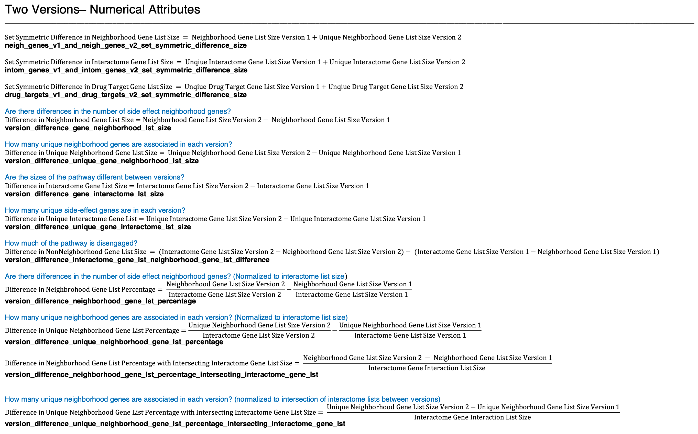
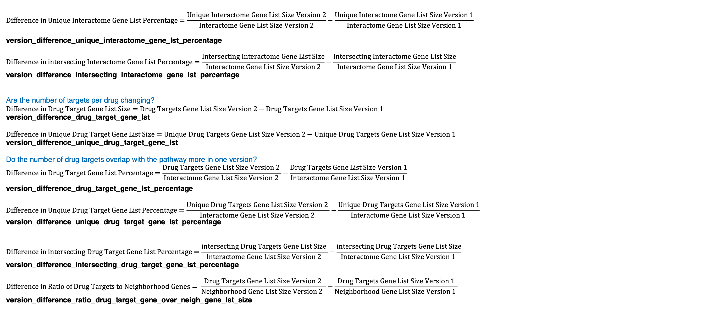

## Attribute Guide Sheet
   

  

### Statistic Tables
   

[**Table (X).**](https://github.com/aryastark5/web_bench/blob/gh-pages/display_files/output_numerical_attributes_assessment/pairwise_numerical_columns_scatterplot_graphs/two_versions_numerical_att_stats.csv)
   

   

[**Table (X).**](https://github.com/aryastark5/web_bench/blob/gh-pages/display_files/output_numerical_attributes_assessment/pairwise_numerical_columns_scatterplot_graphs/two_versions_num_att_stats_per_adverse_event_table.csv)
   

   